# Routes App 🚗

**Mobilna aplikacja do ewidencji podróży służbowych** — automatyczne i ręczne rejestrowanie tras, odczyt przebiegu licznika ze zdjęcia (OCR), raporty PDF z kosztem paliwa oraz synchronizacja w czasie rzeczywistym.

Zbudowana w **React Native + Expo Router**, z backendem opartym o **Firebase** (uwierzytelnianie i baza danych) oraz **Appwrite** (przechowywanie zdjęć).

> Projekt zrealizowany jako aplikacja towarzysząca pracy licencjackiej. Pełna dokumentacja teoretyczna oraz źródła pracy znajdują się w katalogu `LateX_template/`.

---

## 📑 Spis treści

- [Funkcje](#-funkcje)
- [Zrzuty ekranu](#-zrzuty-ekranu)
- [Stos technologiczny](#-stos-technologiczny)
- [Architektura](#-architektura)
- [Struktura projektu](#-struktura-projektu)
- [Instalacja](#-instalacja)
- [Konfiguracja (zmienne środowiskowe)](#-konfiguracja-zmienne-środowiskowe)
- [Uruchomienie](#-uruchomienie)
- [Build (EAS)](#-build-eas)
- [Model danych (Firestore)](#-model-danych-firestore)
- [Reguły bezpieczeństwa](#-reguły-bezpieczeństwa)
- [Jak to działa](#-jak-to-działa)
- [Rozwiązywanie problemów](#-rozwiązywanie-problemów)

---

## ✨ Funkcje

- 🔐 **Uwierzytelnianie** — rejestracja i logowanie e-mail/hasło (Firebase Auth), trwała sesja (AsyncStorage).
- ✍️ **Trasa ręczna** — wpisujesz adres początkowy i końcowy; aplikacja geokoduje adresy i liczy dystans drogowy oraz czas przejazdu.
- 📍 **Trasa GPS na żywo** — start i koniec pobierają aktualną pozycję z GPS, zamieniają ją na adres (reverse geocoding) i zapisują trasę ze statusem `in-progress` → `completed`.
- 🔢 **Odczyt licznika (OCR)** — robisz zdjęcie licznika, a OCR rozpoznaje przebieg; dystans trasy może być wyliczony z **różnicy przebiegu** (start/koniec), a w razie braku danych — z trasy drogowej.
- 📷 **Zdjęcia tras** — robienie/wybór zdjęcia z kadrowaniem; pliki trafiają do **Appwrite Storage** i są dołączane do raportów.
- 🔔 **Powiadomienie o aktywnej trasie** — trwałe (sticky) powiadomienie przypominające o zakończeniu rozpoczętej trasy.
- 🗂️ **Historia i szczegóły tras** — lista tras z synchronizacją w czasie rzeczywistym, podgląd szczegółów, usuwanie (wraz ze zdjęciami).
- 📄 **Raporty PDF** — raport tygodniowy (7 dni) i miesięczny (30 dni) ze zdjęciami i podsumowaniem; udostępnianie systemowym arkuszem.
- ⛽ **Koszty paliwa** — ustawienia spalania (l/100 km) i ceny (zł/l); automatyczne wyliczenie zużycia i kosztu w profilu oraz raportach.
- 🌓 **Motyw jasny/ciemny** — automatyczne dopasowanie do ustawień systemu.

## 📱 Zrzuty ekranu

### Motyw jasny i ciemny

| Jasny | Ciemny |
|:---:|:---:|
| 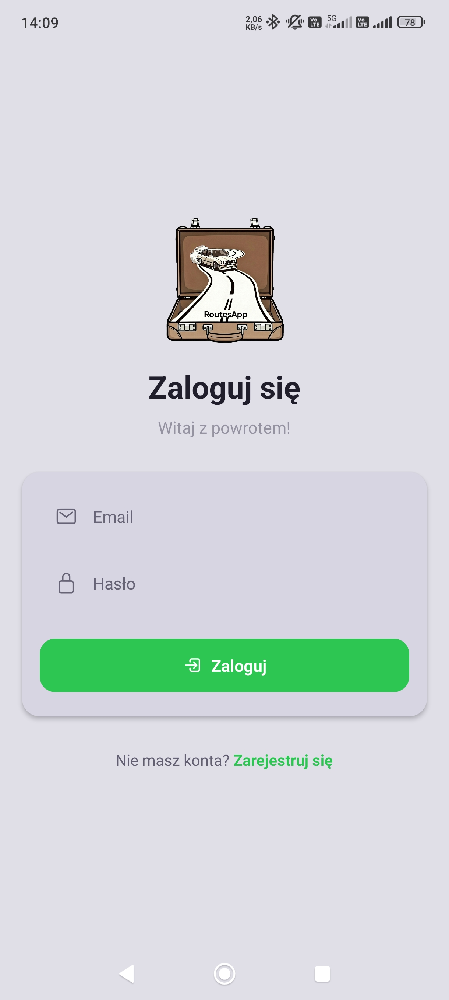 |  |

### Przepływ aplikacji

| Rejestracja | Start trasy | Trasa ręczna |
|:---:|:---:|:---:|
|  | 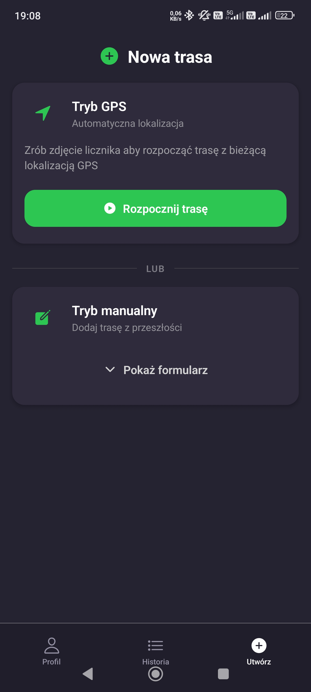 | 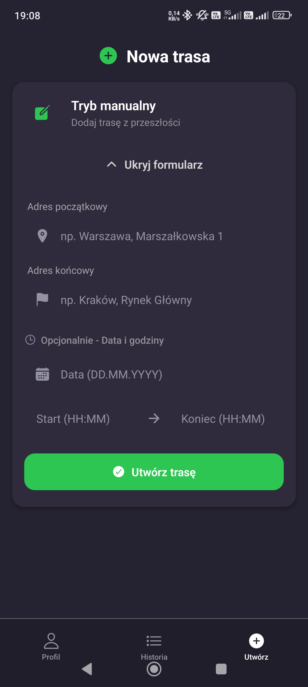 |

| Trasa w trakcie | Powiadomienie | Kadrowanie zdjęcia |
|:---:|:---:|:---:|
| 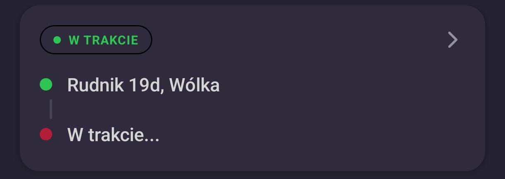 | 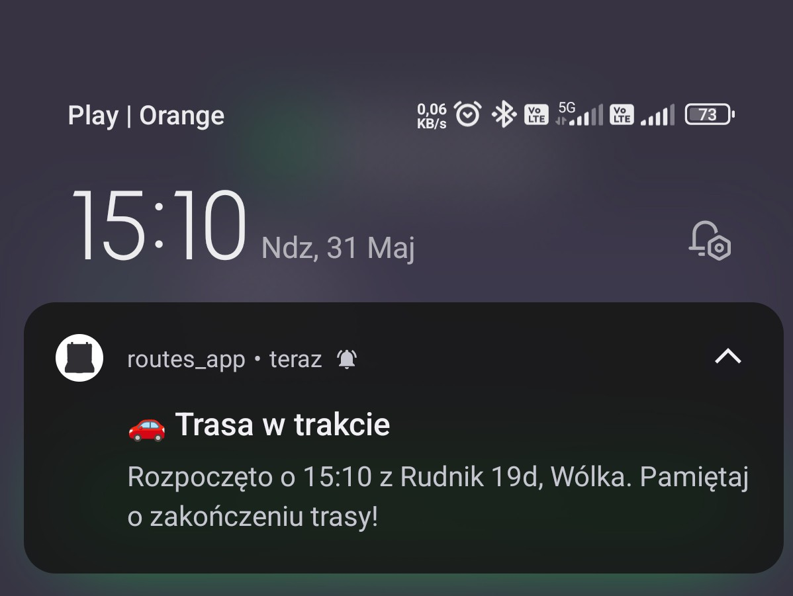 | 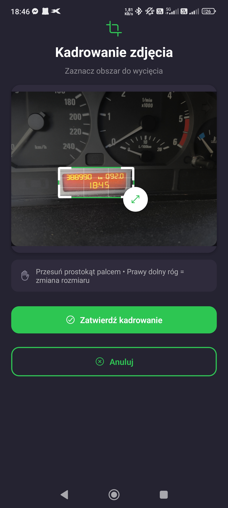 |

| Korekta odczytu OCR | Podsumowanie trasy | Historia tras |
|:---:|:---:|:---:|
| 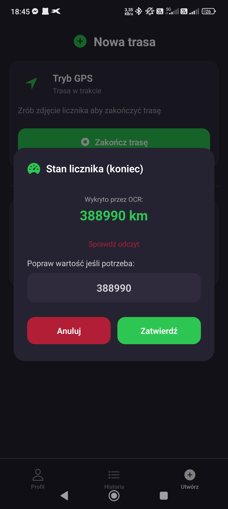 | 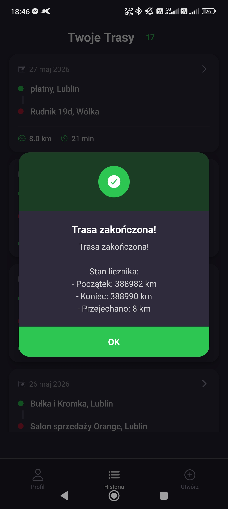 | 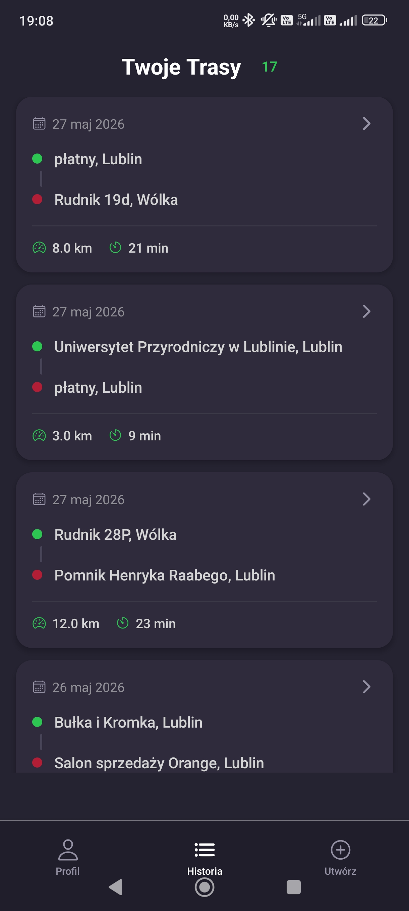 |

| Szczegóły trasy | Szczegóły trasy (cd.) | Profil i raporty |
|:---:|:---:|:---:|
| 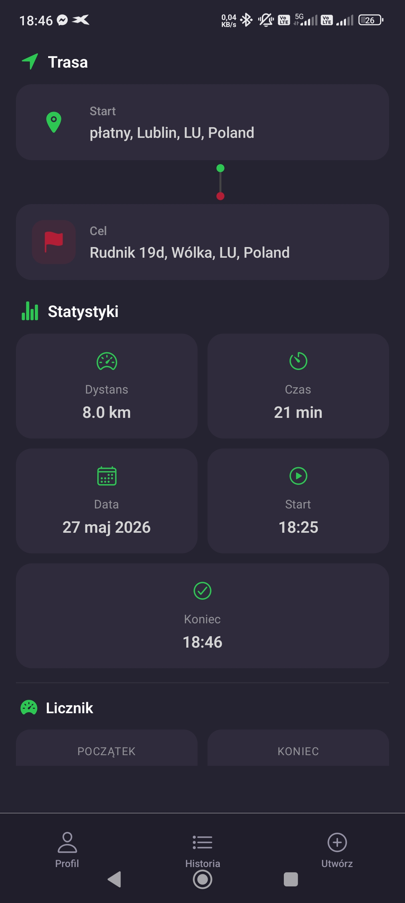 | 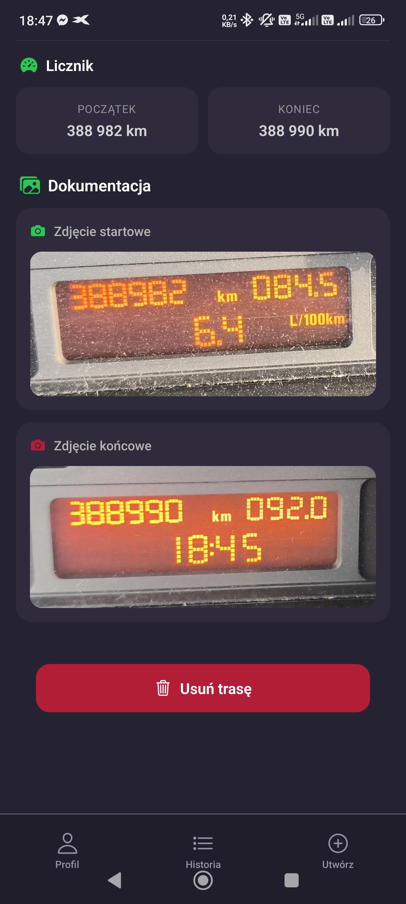 | 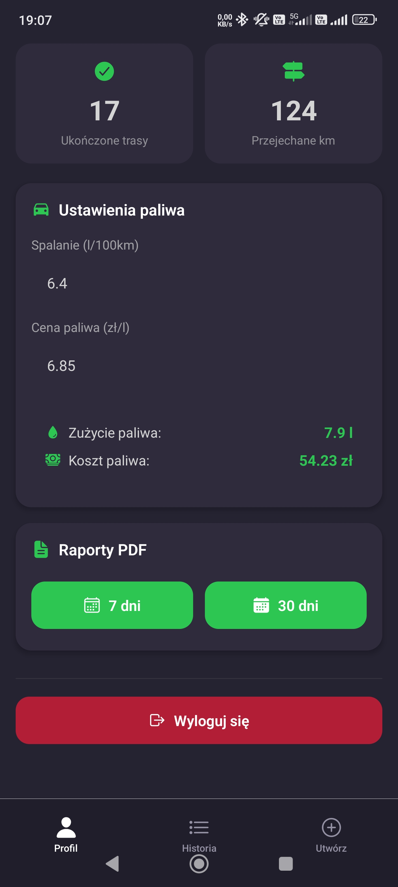 |

### Przykładowy raport PDF

Generowany raport składa się z nagłówka (tytuł i okres), wierszy poszczególnych tras (data, adresy, dystans, godziny i zdjęcia) oraz podsumowania z łącznym dystansem i kosztem paliwa.

**Nagłówek**

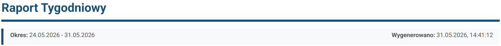

**Wiersz pojedynczej trasy**

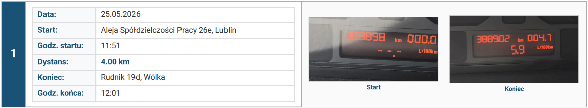

**Podsumowanie**

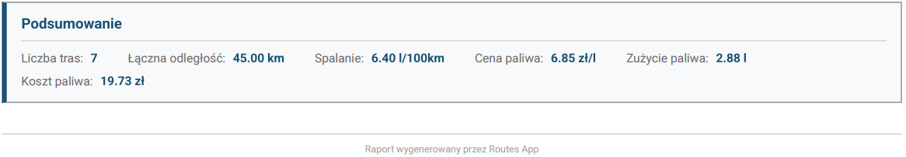

## 🛠 Stos technologiczny

| Warstwa | Technologia |
|---|---|
| Framework | React Native 0.81, React 19 |
| Platforma / nawigacja | Expo SDK 54, **Expo Router 6** (routing oparty na plikach) |
| Uwierzytelnianie | **Firebase Authentication** (e-mail/hasło) |
| Baza danych | **Cloud Firestore** (synchronizacja real-time przez `onSnapshot`) |
| Przechowywanie zdjęć | **Appwrite Storage** |
| Geokodowanie i trasy | **OpenRouteService API** (geocode + directions) |
| OCR (odczyt licznika) | **OCR.space API** |
| Lokalizacja | `expo-location` |
| Aparat / zdjęcia | `expo-camera`, `expo-image-picker`, `expo-image-manipulator` |
| Powiadomienia | `expo-notifications`, `expo-device` |
| Raporty PDF | `expo-print`, `expo-sharing` |
| Pamięć lokalna | `@react-native-async-storage/async-storage` |

## 🏗 Architektura

Aplikacja korzysta z architektury warstwowej, w której ekrany (Expo Router) konsumują globalny stan udostępniany przez **Context API**, a logika integracji z usługami zewnętrznymi jest zamknięta w warstwie serwisów (`lib/`).

| Architektura warstwowa | Hierarchia providerów |
|:---:|:---:|
| 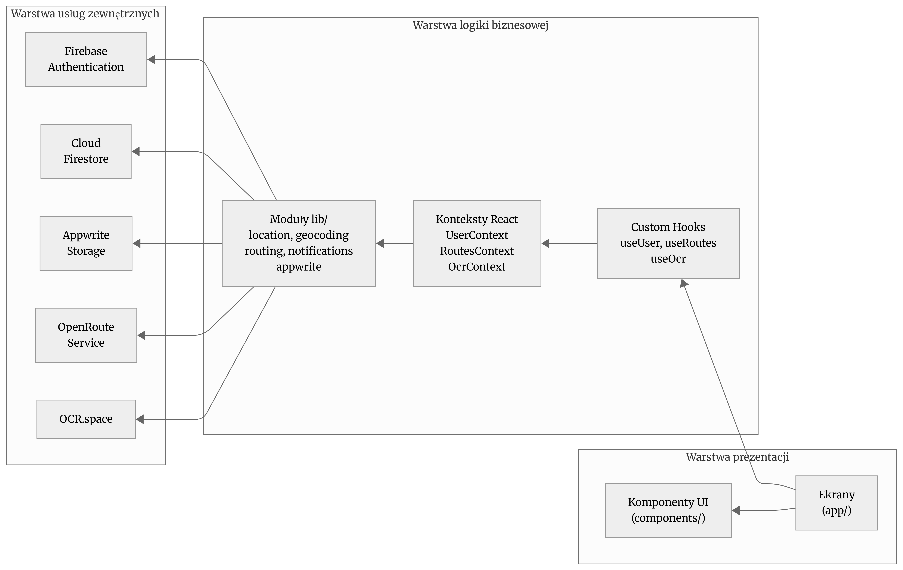 | 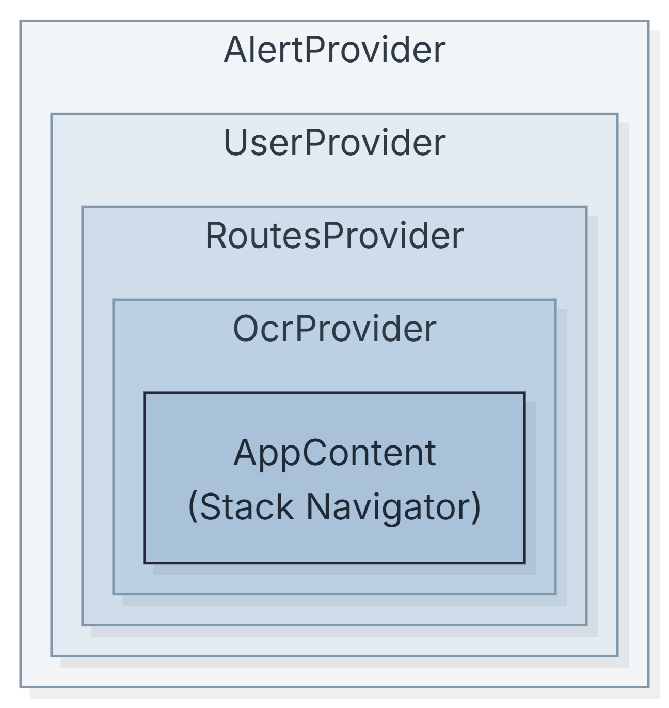 |

| Przepływ uwierzytelniania | Przepływ trasy GPS |
|:---:|:---:|
| 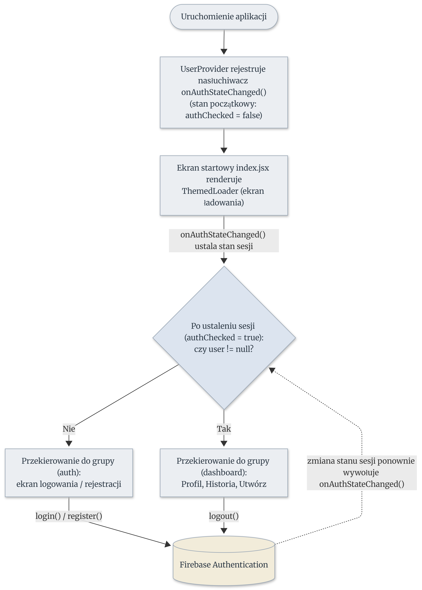 | 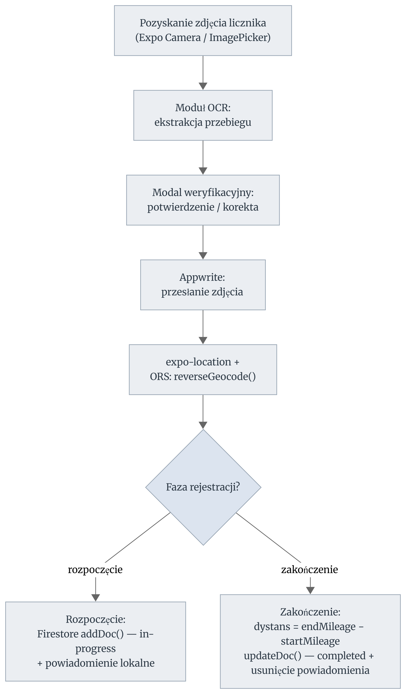 |

**Globalny stan (Context):**

- `UserContext` — sesja użytkownika, `login()`, `register()`, `logout()` (hook `useUser`).
- `RoutesContext` — operacje na trasach: `createRoute`, `startLiveRoute`, `endLiveRoute`, `deleteRoute`, `fetchRouteById` oraz nasłuch tras w czasie rzeczywistym (hook `useRoutes`).
- `OcrContext` — rozpoznawanie tekstu/przebiegu ze zdjęcia (hook `useOcr`).
- `AlertProvider` — spójne, motywowane okna dialogowe.

Hierarchia: `AlertProvider → UserProvider → RoutesProvider → OcrProvider → aplikacja`.

## 📂 Struktura projektu

```
routes_app/
├── app/                          # Ekrany (Expo Router – routing oparty na plikach)
│   ├── (auth)/                   # Tylko dla niezalogowanych (GuestsOnly)
│   │   ├── _layout.jsx
│   │   ├── login.jsx
│   │   └── register.jsx
│   ├── (dashboard)/              # Tylko dla zalogowanych (UserOnly + zakładki)
│   │   ├── _layout.jsx
│   │   ├── create.jsx            # Tworzenie trasy (ręczna / GPS / OCR / zdjęcia)
│   │   ├── history.jsx           # Lista tras
│   │   ├── profile.jsx           # Profil, paliwo, raporty PDF, wylogowanie
│   │   └── routes/[id].jsx       # Szczegóły trasy
│   ├── _layout.jsx               # Root layout + providery
│   └── index.jsx                 # Ekran startowy / przekierowanie
├── components/                   # Komponenty UI (Themed*, auth guards, ImagePickerWithCrop…)
├── context/                      # UserContext, RoutesContext, OcrContext
├── hooks/                        # useUser, useRoutes, useOcr, useActiveRouteNotification
├── lib/                          # Serwisy: firebase, appwrite, geocoding, routing, location, notifications
├── constants/                    # Colors.js (motyw jasny/ciemny)
├── assets/                       # Ikony, logo, splash
├── docs/                         # Diagramy i zrzuty ekranu do README
├── firestore.rules               # Reguły bezpieczeństwa Firestore
├── app.json                      # Konfiguracja Expo (uprawnienia, pluginy)
├── eas.json                      # Konfiguracja buildów EAS
└── package.json
```

## 🚀 Instalacja

**Wymagania:** Node.js 18+, npm, aplikacja **Expo Go** lub *development build* na urządzeniu (część funkcji — powiadomienia, GPS, OCR — najlepiej testować na fizycznym urządzeniu).

```bash
git clone <repo-url>
cd routes_app
npm install
```

## 🔑 Konfiguracja (zmienne środowiskowe)

Skopiuj `.env.example` do `.env` i uzupełnij własnymi kluczami:

```bash
cp .env.example .env
```

| Zmienna | Skąd ją wziąć |
|---|---|
| `EXPO_PUBLIC_FIREBASE_API_KEY` … `EXPO_PUBLIC_FIREBASE_APP_ID` | Firebase Console → *Project settings → Your apps* |
| `EXPO_PUBLIC_APPWRITE_ENDPOINT`, `…_PROJECT_ID`, `…_PROJECT_NAME`, `…_BUCKET_ID` | [Appwrite Cloud](https://cloud.appwrite.io) → projekt + bucket na zdjęcia |
| `EXPO_PUBLIC_ORS_API_KEY` | [OpenRouteService](https://openrouteservice.org/dev/#/signup) (darmowy plan: 2000 req/dzień) |
| `EXPO_PUBLIC_OCR_SPACE_API_KEY` | [OCR.space](https://ocr.space/ocrapi) |

**Po stronie usług trzeba dodatkowo:**

1. **Firebase** — włączyć *Authentication → Email/Password* oraz utworzyć bazę *Firestore* (reguły poniżej).
2. **Appwrite** — utworzyć projekt i *Storage Bucket* na zdjęcia tras; wpisać jego ID do `.env`.

> Wszystkie zmienne mają prefiks `EXPO_PUBLIC_`, więc są wstrzykiwane do bundla po stronie klienta. Plik `.env` jest w `.gitignore` i nie powinien trafić do repozytorium.

## ▶️ Uruchomienie

```bash
npm start          # serwer deweloperski Expo
npm run android    # Android
npm run ios        # iOS
npm run web        # przeglądarka
```

## 📦 Build (EAS)

Profile buildów są zdefiniowane w `eas.json`:

```bash
npm install -g eas-cli
eas login
eas build --profile preview --platform android   # APK do testów
eas build --profile production --platform android # build produkcyjny
```

## 🗄 Model danych (Firestore)

Kolekcja **`routes`** — każdy dokument to jedna trasa:

```jsonc
{
  "userId": "uid",                  // właściciel trasy
  "status": "in-progress | completed",

  "startAddress": "…",              // adres / opis startu
  "endAddress": "…",
  "startAddressFormatted": "…",     // adres po geokodowaniu
  "endAddressFormatted": "…",
  "startCoordinates": { "lat": 0, "lon": 0 },
  "endCoordinates":   { "lat": 0, "lon": 0 },

  "distance": 12.34,                // km
  "distanceMeters": 12340,
  "duration": 18,                   // minuty

  "startMileage": 120000,           // przebieg z OCR (opcjonalnie)
  "endMileage": 120012,
  "mileageDistance": 12,            // dystans z różnicy przebiegu
  "usedMileageForDistance": true,

  "startImageUrl": "…",             // zdjęcia w Appwrite Storage
  "endImageUrl": "…",
  "startImageFileId": "…",
  "endImageFileId": "…",

  "createdAt": "<Timestamp>",
  "startedAt": "<Timestamp>",
  "completedAt": "<Timestamp>"
}
```

Ustawienia paliwa (`fuelConsumption`, `fuelPrice`) przechowywane są lokalnie w **AsyncStorage**.

## 🔒 Reguły bezpieczeństwa

Reguły Firestore znajdują się w pliku [`firestore.rules`](firestore.rules) — użytkownik ma dostęp wyłącznie do własnych tras (`request.auth.uid == resource.data.userId`). Wgraj je w Firebase Console (*Firestore → Rules*) lub przez Firebase CLI:

```bash
firebase deploy --only firestore:rules
```

## ⚙️ Jak to działa

- **Trasa ręczna** (`createRoute`) — adresy → geokodowanie (ORS) → obliczenie dystansu i czasu (ORS directions) → zapis jako `completed`.
- **Trasa GPS** (`startLiveRoute` / `endLiveRoute`) — start: GPS + reverse geocoding + (opcjonalnie) zdjęcie i przebieg → zapis `in-progress` + powiadomienie sticky; koniec: GPS końcowy, wyliczenie dystansu (z przebiegu OCR lub z trasy drogowej), aktualizacja na `completed`, usunięcie powiadomienia.
- **OCR** (`recognizeText`) — zdjęcie wysyłane do OCR.space (język polski, `OCREngine 2`); z tekstu wyłuskiwane są liczby i wykrywany jest przebieg licznika.
- **Powiadomienia** (`lib/notifications.js`) — kanał Android `active-route`, jedno trwałe powiadomienie na aktywną trasę; jego ID jest pamiętane w AsyncStorage.
- **Raporty** (`profile.jsx`) — filtr tras z ostatnich 7/30 dni → generowanie HTML → `expo-print` (PDF) → `expo-sharing` (udostępnienie). Jeśli ustawiono spalanie i cenę paliwa, raport zawiera zużycie i koszt.

## 🐛 Rozwiązywanie problemów

| Problem | Co sprawdzić |
|---|---|
| `permission-denied` z Firestore | Wgrane reguły z `firestore.rules` oraz reguła `allow list` dla `/routes/{routeId}` |
| Brak lokalizacji / trasy GPS nie startują | Włączony GPS i przyznane uprawnienia lokalizacji; testuj na fizycznym urządzeniu |
| Powiadomienia nie pojawiają się | Pełna funkcjonalność wymaga *development build* (Expo Go ma ograniczenia) i przyznanych uprawnień |
| Błędy geokodowania/trasy | Ważny `EXPO_PUBLIC_ORS_API_KEY` i limity API (2000/dzień); połączenie z internetem |
| Zdjęcia się nie zapisują | Poprawny endpoint/projekt/bucket Appwrite w `.env` |
| Aplikacja nie startuje po zmianach | `npx expo start -c` (czyszczenie cache) |

---

<sub>README opisuje aktualny stan kodu aplikacji. Dokumentacja naukowa i diagramy źródłowe — katalog `LateX_template/`.</sub>
