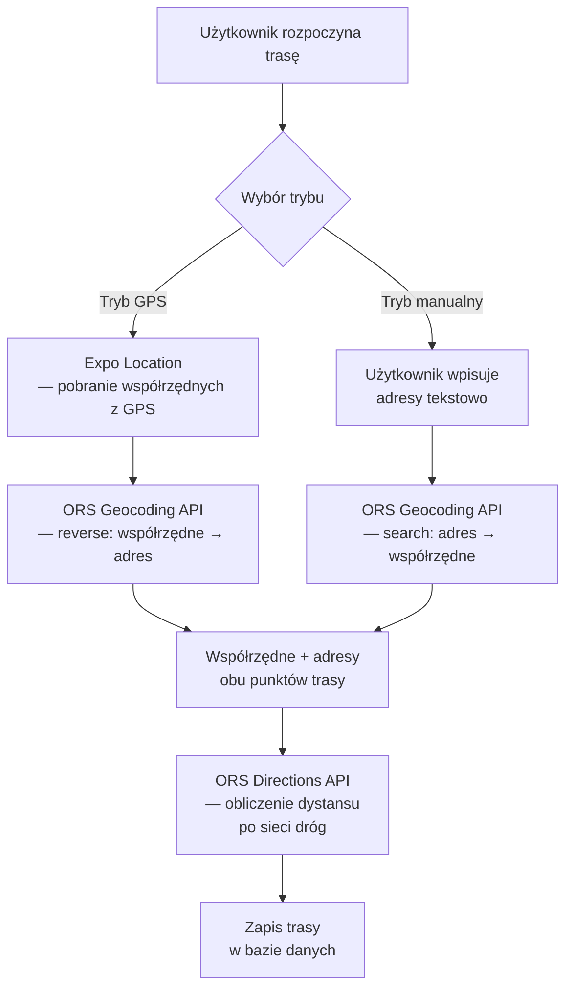
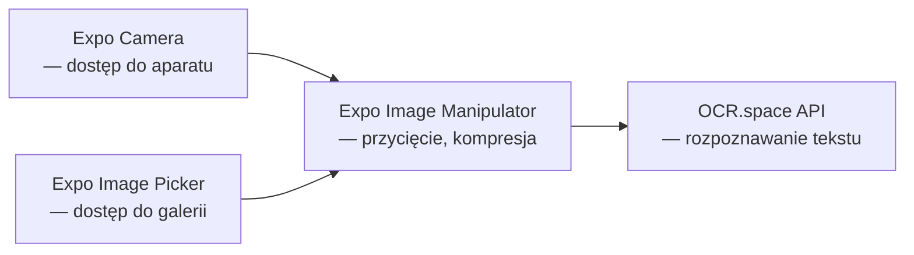

# Aplikacja mobilna wspomagająca rejestrowanie podróży służbowych

## PLAN PRACY

### WSTĘP
Wprowadzenie do problematyki ewidencjonowania podróży służbowych w kontekście obowiązków prawnych i organizacyjnych przedsiębiorstw. Przedstawienie celu pracy, którym jest zaprojektowanie i implementacja aplikacji mobilnej automatyzującej proces rejestrowania tras. Krótka charakterystyka struktury pracy z uzasadnieniem kolejności rozdziałów.

### ROZDZIAŁ 1. Analiza problemu i założenia projektowe
- Charakterystyka problemu ewidencji podróży służbowych w przedsiębiorstwach
- Analiza istniejących rozwiązań na rynku
- Wymagania funkcjonalne aplikacji
- Wymagania niefunkcjonalne
- Założenia projektowe i ograniczenia

### ROZDZIAŁ 2. Wykorzystane technologie
- Framework React Native i platforma Expo
- Firebase (Authentication, Firestore, Cloud Storage)
- Usługi geolokalizacyjne (expo-location, OpenRouteService)
- Technologia OCR (OCR.space)
- System powiadomień
- Biblioteki pomocnicze

### ROZDZIAŁ 3. Architektura i struktura aplikacji
- Architektura wielowarstwowa aplikacji
- Struktura katalogów projektu
- Wzorce projektowe
- Przepływ danych w aplikacji
- Model danych w bazie Firestore
- Mechanizmy bezpieczeństwa

### ROZDZIAŁ 4. Interfejs użytkownika i funkcjonalności
- Nawigacja w aplikacji
- Moduł autoryzacji
- Moduł tworzenia tras
- Moduł historii i szczegółów tras
- Moduł profilu użytkownika
- Generowanie raportów PDF
- Wsparcie dla motywów kolorystycznych

### PODSUMOWANIE
Przypomnienie celu pracy, ewaluacja rozwiązań, ograniczenia, kierunki dalszego rozwoju.

---

## WSTĘP

Współczesne przedsiębiorstwa funkcjonują w środowisku charakteryzującym się wysokim stopniem mobilności pracowników oraz złożonością procesów administracyjnych związanych z rozliczaniem delegacji i podróży służbowych. Obowiązujące przepisy prawa, w szczególności regulacje podatkowe oraz zasady rozliczania kosztów uzyskania przychodu, nakładają na podmioty gospodarcze wymóg prowadzenia szczegółowej dokumentacji przejazdów wykonywanych w celach służbowych. Tradycyjne metody ewidencjonowania tras, oparte na papierowych formularzach lub prostych arkuszach kalkulacyjnych, okazują się niewystarczające wobec rosnących wymagań dotyczących dokładności, terminowości i weryfikowalności wprowadzanych danych.

Problematyka rzetelnego dokumentowania podróży służbowych nabiera szczególnego znaczenia w kontekście wykorzystywania pojazdów prywatnych do celów służbowych, gdzie prawidłowe określenie przejechanego dystansu stanowi podstawę do obliczenia należnego pracownikowi zwrotu kosztów. Manualne prowadzenie ewidencji wiąże się z ryzykiem błędów wynikających z niedokładności odczytów licznika, opóźnień w rejestrowaniu tras czy też niekompletności wprowadzanych informacji. Dodatkowo brak możliwości automatycznej weryfikacji deklarowanych przebiegów utrudnia kontrolę wewnętrzną i może generować nieprawidłowości w rozliczeniach.

Dynamiczny rozwój technologii mobilnych oraz powszechna dostępność smartfonów wyposażonych w odbiorniki GPS otworzyły nowe możliwości w zakresie automatyzacji procesów ewidencyjnych. Urządzenia te dysponują również aparatami fotograficznymi wysokiej rozdzielczości oraz dostępem do usług chmurowych, co umożliwia implementację zaawansowanych funkcjonalności wykraczających poza możliwości tradycyjnych metod dokumentacji. W tym kontekście naturalne staje się pytanie o możliwość wykorzystania potencjału współczesnych technologii mobilnych do usprawnienia procesu rejestrowania podróży służbowych.

Celem niniejszej pracy jest zaprojektowanie oraz implementacja aplikacji mobilnej wspomagającej rejestrowanie podróży służbowych, która poprzez automatyzację kluczowych czynności zminimalizuje nakład pracy użytkownika przy jednoczesnym zwiększeniu dokładności i wiarygodności gromadzonych danych. Aplikacja ma umożliwiać automatyczne pobieranie lokalizacji geograficznej z wykorzystaniem systemu GPS, rozpoznawanie stanu licznika pojazdu na podstawie fotografii przy użyciu technologii optycznego rozpoznawania znaków oraz obliczanie rzeczywistego dystansu trasy z uwzględnieniem siatki drogowej. Dodatkowo system powinien zapewniać bezpieczne przechowywanie danych w infrastrukturze chmurowej oraz generowanie raportów w formacie umożliwiającym dalsze przetwarzanie lub archiwizację.

Realizacja tak zdefiniowanego celu wymagała rozwiązania szeregu problemów technicznych związanych z integracją heterogenicznych usług i interfejsów programistycznych. Konieczny był dobór odpowiedniego stosu technologicznego zapewniającego wieloplatformowość rozwiązania, wybór usług backendowych gwarantujących skalowalność i bezpieczeństwo, a także implementacja algorytmów przetwarzania danych geograficznych i obrazowych. Proces projektowania i implementacji aplikacji stanowi praktyczną ilustrację współczesnych metodyk wytwarzania oprogramowania mobilnego.

Struktura pracy odzwierciedla logiczny przebieg procesu projektowego, prowadząc czytelnika od analizy problemu, przez uzasadnienie wyborów technologicznych, aż po prezentację gotowego rozwiązania. Pierwszy rozdział poświęcony jest charakterystyce problemu ewidencji podróży służbowych oraz analizie wymagań funkcjonalnych i niefunkcjonalnych projektowanej aplikacji. Zidentyfikowane wymagania stanowią punkt wyjścia dla rozważań zawartych w rozdziale drugim, w którym przedstawiono wykorzystane technologie wraz z uzasadnieniem ich wyboru w kontekście specyfiki rozwiązywanego problemu. Rozdział trzeci prezentuje architekturę i strukturę aplikacji, wyjaśniając sposób integracji poszczególnych komponentów w spójną całość oraz omawiając zastosowane wzorce projektowe. Czwarty rozdział stanowi prezentację interfejsu użytkownika i funkcjonalności aplikacji z perspektywy użytkownika końcowego, demonstrując jak przyjęte rozwiązania techniczne i architektoniczne przekładają się na konkretne możliwości systemu. Pracę zamyka podsumowanie zawierające ewaluację zrealizowanych celów, identyfikację ograniczeń obecnej implementacji oraz propozycje kierunków dalszego rozwoju aplikacji.

---

## ROZDZIAŁ 1. Analiza problemu i założenia projektowe

### 1.1. Charakterystyka problemu ewidencji podróży służbowych

Ewidencjonowanie podróży służbowych stanowi jeden z istotnych elementów zarządzania operacyjnego w przedsiębiorstwach, którego znaczenie wykracza dalece poza wymiar czysto administracyjny. Obowiązek prowadzenia dokumentacji przejazdów wynika zarówno z przepisów prawa podatkowego, jak i z wewnętrznych regulacji organizacyjnych mających na celu kontrolę kosztów oraz racjonalizację wykorzystania zasobów transportowych. W przypadku wykorzystywania pojazdów prywatnych do celów służbowych, rzetelna ewidencja stanowi podstawę do naliczenia należnego pracownikowi zwrotu kosztów, obliczanego najczęściej jako iloczyn przejechanej odległości oraz ustalonej stawki kilometrowej.

Tradycyjne podejście do dokumentowania podróży służbowych opiera się na formularzach papierowych lub elektronicznych arkuszach kalkulacyjnych, w których pracownik odnotowuje datę przejazdu, cel podróży, adres początkowy i docelowy, stan licznika na początku i końcu trasy oraz obliczony dystans. Metoda ta, choć koncepcyjnie prosta, obarczona jest szeregiem ograniczeń wynikających z jej manualnego charakteru. Przede wszystkim wymaga ona od użytkownika systematyczności w prowadzeniu zapisów, co w praktyce często skutkuje opóźnieniami i retrospektywnym uzupełnianiem ewidencji na podstawie niepełnych wspomnień. Ponadto ręczne odczytywanie i przepisywanie wartości z licznika pojazdu generuje ryzyko błędów, zarówno przypadkowych pomyłek, jak i celowych manipulacji.

Kolejnym istotnym problemem jest trudność weryfikacji deklarowanych przebiegów. Pracodawca dysponujący jedynie raportem tekstowym nie ma możliwości potwierdzenia, czy podana trasa faktycznie została pokonana oraz czy zadeklarowany dystans odpowiada rzeczywistości. Sytuacja ta komplikuje się dodatkowo w przypadku pracowników wykonujących liczne krótkie przejazdy w ciągu dnia roboczego, gdzie kumulacja drobnych nieścisłości może prowadzić do znaczących rozbieżności w skali miesiąca. Brak mechanizmów automatycznej walidacji sprawia, że proces kontroli wewnętrznej staje się czasochłonny i w praktyce często ogranicza się do wyrywkowego sprawdzania wiarygodności wybranych wpisów.

Z perspektywy pracownika manualne prowadzenie ewidencji stanowi uciążliwy obowiązek administracyjny odciągający uwagę od zasadniczych zadań zawodowych. Konieczność pamiętania o odnotowaniu każdego przejazdu, zapisywania stanów licznika przed i po podróży oraz późniejszego przenoszenia danych do systemu raportowego generuje dodatkowe obciążenie czasowe i poznawcze. W rezultacie część pracowników traktuje ten obowiązek jako formalistyczny wymóg, prowadząc ewidencję w sposób pobieżny lub uzupełniając ją zbiorczo pod koniec okresu rozliczeniowego, co nieuchronnie prowadzi do utraty dokładności i wiarygodności danych.

### 1.2. Analiza istniejących rozwiązań

Rynek aplikacji mobilnych oferuje szereg rozwiązań adresujących problem ewidencji podróży służbowych, jednak analiza dostępnych produktów ujawnia znaczące zróżnicowanie pod względem zakresu funkcjonalności oraz przyjętych założeń projektowych. Część aplikacji koncentruje się na automatycznym śledzeniu trasy z wykorzystaniem odbiornika GPS, rejestrując przebytą drogę w sposób ciągły i obliczając dystans na podstawie zapisanych współrzędnych geograficznych. Rozwiązania te eliminują konieczność manualnego wprowadzania adresów, jednak wymagają ciągłego działania aplikacji w tle, co wiąże się ze zwiększonym zużyciem baterii urządzenia oraz potencjalnymi problemami z prywatnością użytkownika.

Alternatywne podejście reprezentują aplikacje umożliwiające wprowadzanie tras w sposób deklaratywny, gdzie użytkownik podaje adresy początkowy i docelowy, a system oblicza dystans z wykorzystaniem zewnętrznych usług nawigacyjnych. Metoda ta charakteryzuje się mniejszym obciążeniem zasobów urządzenia, jednak nie zapewnia dowodu faktycznego wykonania przejazdu i opiera się wyłącznie na zaufaniu do deklaracji użytkownika. Niektóre rozwiązania oferują możliwość dołączania fotografii jako dokumentacji trasy, jednak rzadko kiedy implementują automatyczne przetwarzanie zawartości zdjęć.

Istotną luką zidentyfikowaną w dostępnych rozwiązaniach jest brak integracji funkcjonalności rozpoznawania tekstu ze zdjęć z procesem rejestrowania tras. Automatyczne odczytywanie stanu licznika pojazdu na podstawie fotografii deski rozdzielczej mogłoby znacząco uprościć proces wprowadzania danych i jednocześnie dostarczyć dokumentację fotograficzną potwierdzającą zadeklarowany przebieg. Połączenie tej funkcjonalności z automatycznym pobieraniem lokalizacji GPS stworzyłoby system oferujący zarówno wygodę użytkowania, jak i wiarygodność gromadzonych danych.

Dodatkowym aspektem różnicującym dostępne rozwiązania jest model przechowywania danych. Aplikacje operujące wyłącznie na lokalnej pamięci urządzenia narażają użytkownika na utratę danych w przypadku awarii lub zmiany telefonu, podczas gdy rozwiązania chmurowe zapewniają trwałość i dostępność danych z wielu urządzeń, jednak rodzą pytania dotyczące prywatności i bezpieczeństwa informacji przechowywanych na serwerach zewnętrznych. Wybór odpowiedniego modelu wymaga zbalansowania tych przeciwstawnych wymagań z uwzględnieniem specyfiki grupy docelowej użytkowników.

### 1.3. Wymagania funkcjonalne

Analiza problemu oraz przegląd istniejących rozwiązań pozwoliły na sformułowanie zestawu wymagań funkcjonalnych, które projektowana aplikacja powinna spełniać. Fundamentalnym wymaganiem jest zapewnienie możliwości rejestrowania podróży służbowych w dwóch trybach odpowiadających różnym scenariuszom użycia. Pierwszy tryb, określany jako tryb GPS lub tryb na żywo, zakłada rozpoczęcie rejestracji bezpośrednio przed wyruszeniem w trasę i zakończenie jej po dotarciu do celu. W tym trybie aplikacja automatycznie pobiera lokalizację geograficzną urządzenia, dokonuje konwersji współrzędnych na adresy tekstowe oraz oblicza dystans trasy. Drugi tryb, nazywany trybem manualnym, umożliwia retrospektywne wprowadzanie tras na podstawie adresów podanych przez użytkownika, co jest przydatne w sytuacjach, gdy użytkownik nie miał możliwości uruchomienia aplikacji przed wyjazdem.

Kolejnym istotnym wymaganiem jest integracja funkcjonalności rozpoznawania tekstu ze zdjęć umożliwiająca automatyczne odczytywanie stanu licznika pojazdu. Użytkownik wykonuje fotografię deski rozdzielczej z widocznym licznikiem, a aplikacja ekstrahuje wartość przebiegu i proponuje jej wykorzystanie w rejestrowanej trasie. Funkcjonalność ta powinna działać zarówno na początku, jak i na końcu trasy, umożliwiając obliczenie przejechanego dystansu jako różnicy stanów licznika. Jednocześnie zdjęcia licznika powinny być przechowywane jako dokumentacja fotograficzna, która może służyć celom kontrolnym lub dowodowym.

Aplikacja powinna zapewniać funkcjonalność uwierzytelniania użytkowników, umożliwiając tworzenie indywidualnych kont oraz bezpieczne logowanie. Mechanizm ten jest niezbędny do zapewnienia separacji danych pomiędzy użytkownikami oraz umożliwienia dostępu do historii tras z różnych urządzeń. Powiązanym wymaganiem jest przechowywanie danych w infrastrukturze chmurowej, gwarantujące trwałość informacji niezależnie od losu urządzenia mobilnego oraz synchronizację w czasie rzeczywistym.

Istotną funkcjonalnością z perspektywy rozliczeniowej jest możliwość generowania raportów zbiorczych za wybrany okres, najczęściej za tydzień lub miesiąc. Raporty powinny być generowane w formacie umożliwiającym wydruk lub przesłanie do działu księgowości, zawierając zestawienie wszystkich tras z danego okresu wraz z podsumowaniem łącznego przebiegu. Uzupełnieniem tej funkcjonalności jest prowadzenie historii wszystkich zarejestrowanych tras z możliwością przeglądania szczegółów poszczególnych przejazdów oraz ich usuwania w razie pomyłki.

### 1.4. Wymagania niefunkcjonalne

Obok wymagań funkcjonalnych określających zakres możliwości aplikacji, zidentyfikowano szereg wymagań niefunkcjonalnych odnoszących się do jakościowych aspektów systemu. Podstawowym wymaganiem tej kategorii jest wieloplatformowość rozwiązania, rozumiana jako możliwość uruchomienia aplikacji zarówno na urządzeniach z systemem operacyjnym Android, jak i iOS. Wymaganie to wynika z realiów rynkowych, gdzie użytkownicy korzystają z urządzeń różnych producentów, a ograniczenie aplikacji do jednej platformy znacząco zawęziłoby potencjalną grupę odbiorców.

Wymaganiem o kluczowym znaczeniu dla akceptacji aplikacji przez użytkowników jest intuicyjność i ergonomia interfejsu. Aplikacja przeznaczona do użytku w kontekście zawodowym musi umożliwiać szybkie wykonanie podstawowych operacji bez konieczności długotrwałego uczenia się obsługi. Szczególnie istotna jest minimalizacja liczby kroków niezbędnych do zarejestrowania trasy, gdyż każda dodatkowa interakcja stanowi barierę mogącą zniechęcić użytkownika do systematycznego korzystania z aplikacji. Interfejs powinien również uwzględniać różnorodność warunków użytkowania, w tym obsługę zarówno w jasnym otoczeniu biurowym, jak i w słabiej oświetlonym wnętrzu samochodu.

Bezpieczeństwo danych użytkowników stanowi wymaganie nienegocjowalne, szczególnie w kontekście przechowywania informacji w infrastrukturze chmurowej. Aplikacja musi zapewniać mechanizmy kontroli dostępu uniemożliwiające odczyt lub modyfikację danych przez osoby nieuprawnione. Komunikacja z serwerami backendowymi powinna odbywać się z wykorzystaniem szyfrowania, a dane składowane w chmurze powinny być chronione regułami bezpieczeństwa weryfikującymi tożsamość użytkownika przed każdą operacją.

Wydajność aplikacji, rozumiana jako responsywność interfejsu oraz czas reakcji na działania użytkownika, wpływa bezpośrednio na doświadczenie użytkowania. Operacje wymagające komunikacji sieciowej, takie jak pobieranie lokalizacji, geokodowanie adresów czy rozpoznawanie tekstu, powinny być realizowane asynchronicznie z odpowiednim sygnalizowaniem postępu, aby nie blokować interfejsu i nie powodować wrażenia zawieszenia aplikacji. Jednocześnie aplikacja powinna racjonalnie gospodarować zasobami urządzenia, w szczególności energią baterii, unikając nadmiernego obciążenia procesora lub ciągłego odpytywania modułu GPS.

### 1.5. Założenia projektowe i ograniczenia

Na podstawie przeprowadzonej analizy sformułowano założenia projektowe stanowiące ramy dla procesu implementacji. Podstawowym założeniem jest realizacja aplikacji w technologii wieloplatformowej z wykorzystaniem wspólnej bazy kodu dla obu platform mobilnych. Decyzja ta, motywowana efektywnością procesu wytwórczego, oznacza wybór frameworka umożliwiającego kompilację do aplikacji natywnych z pojedynczego źródła napisanego w języku wysokiego poziomu. Akceptowanym kompromisem jest potencjalnie niższa wydajność w porównaniu z rozwiązaniami natywnymi, uznano jednak, że dla charakteru projektowanej aplikacji różnica ta nie będzie odczuwalna przez użytkownika końcowego.

Kolejnym założeniem jest wykorzystanie modelu Backend-as-a-Service do realizacji warstwy serwerowej aplikacji. Rozwiązanie to eliminuje konieczność projektowania, implementacji i utrzymywania dedykowanej infrastruktury backendowej, co znacząco redukuje złożoność projektu i umożliwia koncentrację wysiłków na warstwie mobilnej. Przyjęto, że wybrana platforma BaaS powinna oferować zintegrowane usługi uwierzytelniania użytkowników, przechowywania danych strukturalnych oraz plików binarnych, minimalizując liczbę zewnętrznych zależności.

W zakresie usług zewnętrznych przyjęto założenie wykorzystania ogólnodostępnych interfejsów programistycznych oferujących darmowe lub niskokosztowe plany użytkowania. Założenie to wynika z edukacyjnego charakteru projektu oraz dążenia do zapewnienia możliwości kontynuowania działania aplikacji bez generowania znaczących kosztów operacyjnych. Akceptowanym ograniczeniem są limity wywołań charakterystyczne dla darmowych planów, które jednak dla typowego wzorca użytkowania przez pojedynczego użytkownika powinny okazać się wystarczające.

Zidentyfikowano również ograniczenia wynikające z charakteru projektu i dostępnych zasobów. Aplikacja projektowana jest jako rozwiązanie dla użytkowników indywidualnych i nie przewiduje funkcjonalności administracyjnych umożliwiających zarządzanie wieloma użytkownikami przez osobę trzecią, taką jak pracodawca. Implementacja koncentruje się na podstawowym przepływie użytkowania i nie obejmuje zaawansowanych scenariuszy, takich jak praca w trybie offline, synchronizacja danych z zewnętrznymi systemami księgowymi czy obsługa flot pojazdów. Ograniczenia te wyznaczają zakres pierwszej wersji aplikacji i jednocześnie wskazują potencjalne kierunki dalszego rozwoju omówione w podsumowaniu pracy.

---

## ROZDZIAŁ 2. Wykorzystane technologie

### 2.1. Wprowadzenie do stosu technologicznego

Niniejszy rozdział prezentuje technologie wybrane do realizacji aplikacji, pogrupowane w trzy warstwy: warstwę mobilną opartą na React Native i platformie Expo, warstwę backendową w modelu Backend-as-a-Service łączącą usługi Firebase i Appwrite oraz warstwę integracji z zewnętrznymi interfejsami programistycznymi. Każda technologia opisana jest pod kątem dostarczanego interfejsu programistycznego, a jej zastosowanie zilustrowane fragmentami kodu źródłowego projektu.

### 2.2. React Native i platforma Expo

Warstwa mobilna aplikacji zrealizowana została z wykorzystaniem frameworka React Native w połączeniu z platformą Expo, które wspólnie tworzą środowisko do wieloplatformowego wytwarzania aplikacji mobilnych. Niniejszy podrozdział przedstawia obie technologie oraz dwie kluczowe biblioteki Expo wykorzystane w projekcie: Expo Router do obsługi nawigacji i Expo Print do generowania dokumentów.

#### 2.2.1. Framework React Native

React Native jest frameworkiem programistycznym umożliwiającym tworzenie natywnych aplikacji mobilnych z wykorzystaniem języka JavaScript oraz biblioteki React [Meta Platforms, „React Native Documentation", https://reactnative.dev/docs/getting-started (dostęp: 23.03.2026).]. Framework został opracowany przez firmę Meta i udostępniony jako projekt open source w 2015 roku. W projekcie wykorzystano wersję 0.81.5.

Kluczową cechą React Native jest sposób renderowania interfejsu użytkownika. W odróżnieniu od rozwiązań opartych na technologii WebView, gdzie interfejs renderowany jest przez silnik przeglądarki internetowej, React Native mapuje komponenty napisane w JavaScript na rzeczywiste komponenty natywne platformy docelowej [Meta Platforms, „React Native Documentation", https://reactnative.dev/docs/getting-started (dostęp: 23.03.2026).]. Architektura frameworka opiera się na tzw. moście (*bridge*), stanowiącym warstwę komunikacyjną pomiędzy kodem JavaScript a natywnymi modułami platformy. Komunikacja ta odbywa się asynchronicznie, co pozwala na utrzymanie responsywności interfejsu nawet podczas intensywnych operacji [Eisenman, B., *Learning React Native*, 2nd ed., O'Reilly Media, 2017.].

Programowanie interfejsu użytkownika w React Native opiera się na składni JSX, będącej rozszerzeniem języka JavaScript o elementy deklaratywne wizualnie przypominające znaczniki HTML, lecz mapowane na natywne komponenty mobilne. Przykładowo, komponent `<View>` odpowiada natywnemu `UIView` na platformie iOS oraz `android.view.View` na platformie Android [Meta Platforms, „React Native Documentation", https://reactnative.dev/docs/getting-started (dostęp: 23.03.2026).]. Model ten, w połączeniu z jednokierunkowym przepływem danych i mechanizmem stanu komponentów, sprzyja tworzeniu kodu modularnego i łatwego w utrzymaniu.

#### 2.2.2. Platforma Expo

Expo jest platformą stanowiącą warstwę abstrakcji nad React Native, dostarczającą zunifikowane interfejsy programistyczne do funkcjonalności platformowych oraz narzędzia usprawniające proces wytwórczy [Expo Documentation, „Introduction to Expo", https://docs.expo.dev/ (dostęp: 23.03.2026).]. W projekcie wykorzystano wersję 54.0.20. Platforma składa się z trzech głównych elementów: zestawu bibliotek programistycznych (Expo SDK), narzędzi deweloperskich oraz usługi Expo Application Services (EAS) do budowania i dystrybucji aplikacji.

Expo SDK dostarcza biblioteki obsługujące typowe funkcjonalności aplikacji mobilnych — od dostępu do aparatu i galerii, przez usługi lokalizacyjne, po powiadomienia i generowanie dokumentów. Wykorzystanie tych bibliotek zamiast bezpośredniej integracji z natywnymi API znacząco redukuje ilość kodu specyficznego dla poszczególnych platform [Expo Documentation, „Introduction to Expo", https://docs.expo.dev/ (dostęp: 23.03.2026).]. Usługa EAS umożliwia budowanie produkcyjnych wersji aplikacji w infrastrukturze chmurowej, eliminując wymóg posiadania lokalnego środowiska deweloperskiego dla każdej platformy docelowej, co jest szczególnie istotne przy kompilacji aplikacji iOS wymagającej systemu macOS.

#### 2.2.3. Expo Router

Expo Router w wersji 6.0.14 jest biblioteką implementującą paradygmat nawigacji opartej na strukturze systemu plików (*file-based routing*), zainspirowany rozwiązaniami stosowanymi w frameworkach webowych takich jak Next.js [4]. Każdy plik z rozszerzeniem JSX umieszczony w katalogu `app/` reprezentuje odrębny ekran aplikacji, a ścieżki nawigacyjne generowane są automatycznie na podstawie hierarchii katalogów.

Biblioteka udostępnia komponenty nawigacyjne `Stack` i `Tabs`, odpowiadające za dwa główne wzorce nawigacji w aplikacjach mobilnych: nawigację stosową (przejścia między ekranami z możliwością powrotu) oraz nawigację zakładkową (przełączanie między sekcjami aplikacji) [Expo Documentation, „Expo Router — Introduction", https://docs.expo.dev/router/introduction/ (dostęp: 23.03.2026).].

```javascript
import { Stack } from "expo-router";

<Stack>
  <Stack.Screen name="index" options={{ headerShown: false }} />
  <Stack.Screen name="(auth)" options={{ headerShown: false }} />
  <Stack.Screen name="(dashboard)" options={{ headerShown: false }} />
</Stack>
```
*Listing 2.1. Konfiguracja nawigacji stosowej z wykorzystaniem komponentu Stack — kod własny*
<!-- ZRZUT EKRANU: app/_layout.jsx, linie 21–32 -->

Komponent `Stack` definiuje nawigator stosowy, którego bezpośrednie dzieci (`Stack.Screen`) reprezentują ekrany dostępne na danym poziomie hierarchii. Atrybut `name` odpowiada nazwie pliku lub katalogu w strukturze projektu, a `options` pozwala na konfigurację nagłówka i zachowania ekranu [Expo Documentation, „Expo Router — Introduction", https://docs.expo.dev/router/introduction/ (dostęp: 23.03.2026).]. Nazwy w nawiasach okrągłych, jak `(auth)` i `(dashboard)`, oznaczają tzw. grupy tras — katalogi organizacyjne, które nie wpływają na ścieżkę URL, lecz umożliwiają zastosowanie odrębnych layoutów dla różnych sekcji aplikacji.

Expo Router obsługuje również trasy dynamiczne z parametrami. Plik o nazwie `[id].jsx` definiuje trasę parametryzowaną, w której wartość parametru dostępna jest za pośrednictwem hooka `useLocalSearchParams()`.

```javascript
import { Tabs } from "expo-router";

<Tabs.Screen name="routes/[id]" options={{ href: null }} />
```
*Listing 2.2. Definicja trasy dynamicznej w nawigatorze zakładkowym — kod własny*
<!-- ZRZUT EKRANU: app/(dashboard)/_layout.jsx, linia 72 -->

Opcja `href: null` ukrywa trasę dynamiczną z paska zakładek, zachowując jej dostępność programową — jest to typowy wzorzec dla ekranów szczegółowych, do których nawigacja odbywa się z poziomu listy, a nie bezpośrednio z paska nawigacji [Expo Documentation, „Expo Router — Introduction", https://docs.expo.dev/router/introduction/ (dostęp: 23.03.2026).].

#### 2.2.4. Expo Print i Expo Sharing

Biblioteka Expo Print w wersji 15.0.7 umożliwia generowanie dokumentów PDF z szablonów HTML bezpośrednio na urządzeniu mobilnym [Expo Documentation, „Introduction to Expo", https://docs.expo.dev/ (dostęp: 23.03.2026).]. Biblioteka Expo Sharing w wersji 14.0.7 uzupełnia ten proces o możliwość udostępniania wygenerowanych plików za pośrednictwem systemowego interfejsu udostępniania.

Metoda `printToFileAsync()` przyjmuje ciąg znaków HTML i generuje z niego plik PDF zapisywany w katalogu tymczasowym urządzenia. Metoda `shareAsync()` otwiera systemowy dialog udostępniania, umożliwiając użytkownikowi zapisanie pliku lub przesłanie go przez wybraną aplikację [Expo Documentation, „Introduction to Expo", https://docs.expo.dev/ (dostęp: 23.03.2026).].

```javascript
const { uri } = await Print.printToFileAsync({ html });

const isAvailable = await Sharing.isAvailableAsync();
if (isAvailable) {
  await Sharing.shareAsync(uri, {
    mimeType: "application/pdf",
    dialogTitle: "Zapisz raport",
    UTI: "com.adobe.pdf",
  });
}
```
*Listing 2.3. Generowanie pliku PDF i udostępnianie za pomocą Expo Print i Sharing — kod własny*
<!-- ZRZUT EKRANU: app/(dashboard)/profile.jsx, linie 503–511 -->

Metoda `isAvailableAsync()` sprawdza, czy urządzenie obsługuje funkcję udostępniania — jest to istotne, ponieważ na niektórych emulatorach i konfiguracjach systemowych funkcja ta może być niedostępna. Parametr `mimeType` określa typ MIME udostępnianego pliku, a `UTI` (*Uniform Type Identifier*) jest identyfikatorem typu stosowanym na platformie iOS [Expo Documentation, „Introduction to Expo", https://docs.expo.dev/ (dostęp: 23.03.2026).].

#### 2.2.5. Źródła

[1] Meta Platforms, „React Native Documentation", https://reactnative.dev/docs/getting-started (dostęp: 23.03.2026).

[2] Eisenman, B., *Learning React Native*, 2nd ed., O'Reilly Media, 2017.

[3] Expo Documentation, „Introduction to Expo", https://docs.expo.dev/ (dostęp: 23.03.2026).

[4] Expo Documentation, „Expo Router — Introduction", https://docs.expo.dev/router/introduction/ (dostęp: 23.03.2026).

### 2.3. Firebase Authentication

Firebase Authentication jest usługą uwierzytelniania wchodzącą w skład platformy Firebase, oferowanej przez Google w modelu Backend-as-a-Service [Firebase Documentation, „Firebase Authentication — Web", https://firebase.google.com/docs/auth/web/start (dostęp: 24.03.2026).]. Usługa ta dostarcza gotowe mechanizmy rejestracji, logowania i zarządzania sesjami użytkowników, eliminując konieczność implementacji własnego serwera uwierzytelniającego [Moroney, L., *The Definitive Guide to Firebase*, Apress, 2017.]. Firebase Authentication obsługuje wiele metod uwierzytelniania — od klasycznej kombinacji email i hasło, przez dostawców tożsamości OAuth (Google, Apple, Facebook), po logowanie anonimowe i telefoniczne [Firebase Documentation, „Firebase Authentication — Web", https://firebase.google.com/docs/auth/web/start (dostęp: 24.03.2026).]. W projekcie wykorzystano metodę email/hasło.

#### 2.3.1. Inicjalizacja i persystencja sesji

Konfiguracja Firebase Authentication wymaga utworzenia instancji aplikacji Firebase na podstawie obiektu konfiguracyjnego zawierającego klucze identyfikujące projekt, a następnie zainicjalizowania modułu uwierzytelniania. W środowisku React Native standardowy mechanizm persystencji sesji oparty na przeglądarce internetowej jest niedostępny, dlatego konieczne jest jawne wskazanie alternatywnego magazynu danych [Firebase Documentation, „Firebase Authentication — Web", https://firebase.google.com/docs/auth/web/start (dostęp: 24.03.2026).].

```javascript
import { initializeApp } from "firebase/app";
import { initializeAuth, getReactNativePersistence } from "firebase/auth";
import AsyncStorage from "@react-native-async-storage/async-storage";

const app = initializeApp(firebaseConfig);

export const auth = initializeAuth(app, {
  persistence: getReactNativePersistence(AsyncStorage),
});
```
*Listing 2.4. Inicjalizacja Firebase Authentication z persystencją sesji w AsyncStorage — kod własny*
<!-- ZRZUT EKRANU: lib/firebase.js, linie 1–4 oraz 15–19 -->

Funkcja `initializeAuth()` zastępuje standardową `getAuth()` i przyjmuje drugi argument konfiguracyjny, w którym opcja `persistence` wskazuje mechanizm trwałego przechowywania tokenów sesji. Adapter `getReactNativePersistence()` integruje Firebase z biblioteką AsyncStorage — asynchronicznym magazynem klucz-wartość dostępnym na urządzeniu mobilnym [Firebase Documentation, „Firebase Authentication — Web", https://firebase.google.com/docs/auth/web/start (dostęp: 24.03.2026).]. Dzięki temu token sesji zapisywany jest lokalnie i automatycznie odtwarzany przy kolejnym uruchomieniu aplikacji, eliminując konieczność ponownego logowania.

#### 2.3.2. Rejestracja i logowanie

Firebase Authentication udostępnia funkcje `createUserWithEmailAndPassword()` do rejestracji nowego konta oraz `signInWithEmailAndPassword()` do logowania istniejącego użytkownika [Firebase Documentation, „Firebase Authentication — Web", https://firebase.google.com/docs/auth/web/start (dostęp: 24.03.2026).]. Obie metody działają asynchronicznie i zwracają obiekt `UserCredential` zawierający dane uwierzytelnionego użytkownika.

```javascript
import {
  createUserWithEmailAndPassword,
  signInWithEmailAndPassword,
  signOut,
} from "firebase/auth";

async function login(email, password) {
  const userCredential = await signInWithEmailAndPassword(
    auth, email, password,
  );
  setUser(userCredential.user);
}

async function register(email, password) {
  await createUserWithEmailAndPassword(auth, email, password);
  await login(email, password);
}
```
*Listing 2.5. Rejestracja i logowanie z wykorzystaniem Firebase Authentication — kod własny*
<!-- ZRZUT EKRANU: context/UserContext.jsx, linie 17–38 -->

Metoda `signInWithEmailAndPassword()` przyjmuje instancję `auth`, adres email i hasło, a w przypadku powodzenia zwraca obiekt `userCredential.user` zawierający identyfikator użytkownika (`uid`), adres email oraz metadane konta. Walidacja formatu adresu email i siły hasła realizowana jest po stronie Firebase — próba logowania z nieprawidłowymi danymi powoduje wygenerowanie błędu z kodem identyfikującym przyczynę [Firebase Documentation, „Firebase Authentication — Web", https://firebase.google.com/docs/auth/web/start (dostęp: 24.03.2026).].

#### 2.3.3. Nasłuchiwanie stanu uwierzytelnienia

Centralnym mechanizmem zarządzania sesją jest funkcja `onAuthStateChanged()`, rejestrująca obserwatora wywoływanego automatycznie przy każdej zmianie stanu uwierzytelnienia — zarówno po zalogowaniu, wylogowaniu, jak i przy automatycznym odtworzeniu sesji z AsyncStorage [Firebase Documentation, „Firebase Authentication — Web", https://firebase.google.com/docs/auth/web/start (dostęp: 24.03.2026).].

```javascript
import { onAuthStateChanged } from "firebase/auth";

useEffect(() => {
  const unsubscribe = onAuthStateChanged(auth, (currentUser) => {
    setUser(currentUser);
    setAuthChecked(true);
  });

  return () => unsubscribe();
}, []);
```
*Listing 2.6. Nasłuchiwanie zmian stanu uwierzytelnienia w komponencie React — kod własny*
<!-- ZRZUT EKRANU: context/UserContext.jsx, linie 51–59 -->

Funkcja `onAuthStateChanged()` zwraca funkcję `unsubscribe`, która jest wywoływana w fazie czyszczenia hooka `useEffect`, zapobiegając wyciekom pamięci. Callback otrzymuje obiekt użytkownika (`currentUser`) lub wartość `null`, jeśli użytkownik nie jest zalogowany. Flaga `authChecked` sygnalizuje zakończenie weryfikacji stanu sesji, co pozwala na wyświetlenie ekranu ładowania do momentu ustalenia statusu uwierzytelnienia [Firebase Documentation, „Firebase Authentication — Web", https://firebase.google.com/docs/auth/web/start (dostęp: 24.03.2026).].

#### 2.3.4. Źródła

[1] Firebase Documentation, „Firebase Authentication — Web", https://firebase.google.com/docs/auth/web/start (dostęp: 24.03.2026).

[2] Moroney, L., *The Definitive Guide to Firebase*, Apress, 2017.

### 2.4. Firebase Cloud Firestore

Firebase Cloud Firestore jest nierelacyjną bazą danych typu NoSQL o architekturze dokumentowej, wchodzącą w skład platformy Firebase [Firebase Documentation, „Cloud Firestore — Web", https://firebase.google.com/docs/firestore/quickstart (dostęp: 24.03.2026).]. Dane w Firestore organizowane są w kolekcje (*collections*) zawierające dokumenty (*documents*), gdzie każdy dokument jest zbiorem par klucz-wartość o elastycznej strukturze, niewymagającej z góry zdefiniowanego schematu [Firebase Documentation, „Cloud Firestore — Web", https://firebase.google.com/docs/firestore/quickstart (dostęp: 24.03.2026).]. Firestore udostępnia interfejs programistyczny do operacji CRUD oraz mechanizm synchronizacji danych w czasie rzeczywistym. W projekcie baza służy do przechowywania informacji o zarejestrowanych trasach podróży służbowych.

#### 2.4.1. Operacje zapisu

Firestore udostępnia funkcje modyfikujące dane w kolekcjach: `addDoc()` do tworzenia nowego dokumentu z automatycznie generowanym identyfikatorem, `updateDoc()` do aktualizacji wybranych pól istniejącego dokumentu oraz `deleteDoc()` do usuwania dokumentu [Firebase Documentation, „Cloud Firestore — Web", https://firebase.google.com/docs/firestore/quickstart (dostęp: 24.03.2026).]. Klasa `Timestamp` zapewnia spójną reprezentację znaczników czasu niezależną od strefy czasowej urządzenia.

```javascript
import {
  collection, addDoc, updateDoc, deleteDoc,
  doc, query, where, onSnapshot, Timestamp,
} from "firebase/firestore";

await addDoc(collection(db, COLLECTION_NAME), {
  startAddress: data.startAddress,
  endAddress: data.endAddress,
  distance: routeInfo.distance,
  userId: user.uid,
  createdAt: Timestamp.now(),
  status: "completed",
});
```
*Listing 2.7. Utworzenie dokumentu w kolekcji Firestore metodą addDoc — kod własny*
<!-- ZRZUT EKRANU: context/RoutesContext.jsx, linie 4–15 oraz 116 -->

Funkcja `addDoc()` przyjmuje referencję do kolekcji i obiekt danych, a zwraca referencję do nowo utworzonego dokumentu z automatycznie wygenerowanym unikalnym identyfikatorem. Aktualizacja istniejącego dokumentu realizowana jest przez `updateDoc()`, która przyjmuje referencję do konkretnego dokumentu uzyskaną za pomocą funkcji `doc()`.

```javascript
const routeRef = doc(db, COLLECTION_NAME, routeId);
await updateDoc(routeRef, updateData);
```
*Listing 2.8. Aktualizacja dokumentu Firestore metodą updateDoc — kod własny*
<!-- ZRZUT EKRANU: context/RoutesContext.jsx, linie 367–368 -->

Metoda `updateDoc()` modyfikuje wyłącznie pola wymienione w przekazanym obiekcie, pozostawiając pozostałe pola dokumentu niezmienione — jest to tzw. częściowa aktualizacja (*partial update*), odróżniająca ją od operacji `setDoc()`, która zastępuje cały dokument [Firebase Documentation, „Cloud Firestore — Web", https://firebase.google.com/docs/firestore/quickstart (dostęp: 24.03.2026).].

#### 2.4.2. Zapytania i synchronizacja w czasie rzeczywistym

Firestore umożliwia konstruowanie zapytań przez kompozycję funkcji `query()` i operatorów filtrujących, takich jak `where()`. Tak skonstruowane zapytanie może być wykonane jednorazowo lub przekazane do funkcji `onSnapshot()`, która rejestruje nasłuchiwacz wywoływany automatycznie przy każdej zmianie danych spełniających kryteria zapytania [Firebase Documentation, „Cloud Firestore — Web", https://firebase.google.com/docs/firestore/quickstart (dostęp: 24.03.2026).].

```javascript
const q = query(
  collection(db, COLLECTION_NAME),
  where("userId", "==", user.uid),
);

unsubscribe = onSnapshot(q, (querySnapshot) => {
  const routesData = [];
  querySnapshot.forEach((doc) => {
    routesData.push({
      id: doc.id,
      ...doc.data(),
    });
  });
  setRoutes(routesData);
});

return () => unsubscribe();
```
*Listing 2.9. Nasłuchiwanie zmian w kolekcji Firestore z filtrowaniem po użytkowniku — kod własny*
<!-- ZRZUT EKRANU: context/RoutesContext.jsx, linie 413–437 -->

Operator `where("userId", "==", user.uid)` ogranicza wyniki do dokumentów należących do zalogowanego użytkownika. Funkcja `onSnapshot()` zwraca funkcję `unsubscribe`, którą należy wywołać przy odmontowaniu komponentu, aby odrejestrować nasłuchiwacz i uniknąć wycieków pamięci. Obiekt `querySnapshot` udostępnia metodę `forEach()` do iteracji po dokumentach spełniających kryteria zapytania. Każdy dokument udostępnia właściwość `id` (identyfikator) oraz metodę `data()` zwracającą zapisane pola [Firebase Documentation, „Cloud Firestore — Web", https://firebase.google.com/docs/firestore/quickstart (dostęp: 24.03.2026).]. Mechanizm ten zapewnia automatyczną synchronizację interfejsu użytkownika ze stanem bazy danych bez konieczności ręcznego odświeżania.

#### 2.4.3. Źródła

[1] Firebase Documentation, „Cloud Firestore — Web", https://firebase.google.com/docs/firestore/quickstart (dostęp: 24.03.2026).

[2] Moroney, L., *The Definitive Guide to Firebase*, Apress, 2017.

### 2.5. Usługi geolokalizacyjne

Rejestrowanie podróży służbowych wymaga przetwarzania danych przestrzennych na kilku etapach: od pozyskania współrzędnych geograficznych urządzenia, przez ich konwersję na adresy czytelne dla użytkownika, aż po obliczenie dystansu trasy uwzględniającego rzeczywisty przebieg sieci drogowej. W aplikacji zadania te realizowane są przez dwa niezależne komponenty – bibliotekę Expo Location odpowiedzialną za interakcję z odbiornikiem GPS urządzenia mobilnego [Expo Documentation, „Location — Expo SDK", https://docs.expo.dev/versions/latest/sdk/location/ (dostęp: 19.03.2026).] oraz interfejs programistyczny OpenRouteService dostarczający usługi geokodowania i wyznaczania tras [OpenRouteService, „API Documentation — Geocoding, Directions", https://openrouteservice.org/dev/#/api-docs (dostęp: 19.03.2026).]. Sposób wykorzystania tych komponentów zależy od trybu rejestrowania trasy wybranego przez użytkownika, co ilustruje poniższy diagram.


*Rysunek 2.1. Przepływ danych geolokalizacyjnych w zależności od trybu rejestrowania trasy (opracowanie własne)*

Jak przedstawiono na diagramie, oba tryby prowadzą do tego samego rezultatu – zestawu współrzędnych, adresów oraz dystansu – różnią się natomiast kolejnością i kierunkiem konwersji danych geoprzestrzennych. Dzięki takiej architekturze logika zapisu trasy jest niezależna od źródła danych wejściowych.

#### 2.5.1. Expo Location – pozyskiwanie pozycji GPS

Biblioteka Expo Location w wersji 19.0.7 dostarcza zunifikowany interfejs programistyczny do interakcji z usługami lokalizacyjnymi urządzenia mobilnego, abstrahując różnice pomiędzy platformami Android i iOS [Expo Documentation, „Location — Expo SDK", https://docs.expo.dev/versions/latest/sdk/location/ (dostęp: 19.03.2026).]. W trybie GPS aplikacja wykorzystuje tę bibliotekę w dwóch kluczowych momentach: przy rozpoczęciu trasy (pobranie lokalizacji punktu startowego) oraz przy jej zakończeniu (pobranie lokalizacji punktu docelowego).

Przed każdym odczytem pozycji wymagane jest uzyskanie uprawnień użytkownika do dostępu do lokalizacji. Aplikacja realizuje to dwuetapowo: najpierw sprawdza aktualny stan uprawnień, a w przypadku ich braku wyświetla systemowy dialog z prośbą o ich przyznanie.

```javascript
const { status: existingStatus } =
  await Location.getForegroundPermissionsAsync();

if (existingStatus !== "granted") {
  const { status } = await Location.requestForegroundPermissionsAsync();
  finalStatus = status;
}
```
*Listing 2.1. Weryfikacja i żądanie uprawnień lokalizacyjnych — kod własny*
<!-- ZRZUT EKRANU: lib/location.js, linie 7–16 -->

Metoda `getForegroundPermissionsAsync()` zwraca obiekt zawierający pole `status`, które przyjmuje wartość `"granted"` w przypadku wcześniejszego przyznania uprawnień. Jeśli uprawnienia nie zostały jeszcze przyznane, wywoływana jest metoda `requestForegroundPermissionsAsync()`, która prezentuje użytkownikowi systemowy dialog uprawnień zgodny z wytycznymi danej platformy [Expo Documentation, „Location — Expo SDK", https://docs.expo.dev/versions/latest/sdk/location/ (dostęp: 19.03.2026).]. Zastosowanie uprawnień typu *foreground* oznacza, że aplikacja może pobierać lokalizację wyłącznie gdy jest aktywna na pierwszym planie, co jest wystarczające dla scenariusza rejestrowania tras i jednocześnie respektuje prywatność użytkownika.

Po uzyskaniu uprawnień aplikacja pobiera bieżącą pozycję urządzenia z zastosowaniem konfigurowalnego poziomu dokładności. W projekcie wykorzystano poziom `Location.Accuracy.High`, stanowiący kompromis pomiędzy precyzją odczytu a czasem odpowiedzi modułu GPS.

```javascript
const defaultOptions = {
  accuracy: Location.Accuracy.High,
  timeout: 15000,
  maximumAge: 10000,
};

const location = await Location.getCurrentPositionAsync(finalOptions);

const result = {
  lat: location.coords.latitude,
  lon: location.coords.longitude,
  accuracy: location.coords.accuracy,
  altitude: location.coords.altitude,
  speed: location.coords.speed,
  heading: location.coords.heading,
  timestamp: location.timestamp,
};
```
*Listing 2.2. Konfiguracja parametrów odczytu i pobranie bieżącej pozycji GPS — kod własny*
<!-- ZRZUT EKRANU: lib/location.js, linie 42–46 oraz 63–73 -->

Obiekt `defaultOptions` definiuje trzy parametry odczytu: `accuracy` określa żądaną dokładność pomiaru, `timeout` ogranicza czas oczekiwania na odczyt do 15 sekund, a `maximumAge` pozwala na wykorzystanie pozycji buforowanej przez system operacyjny, jeśli została pobrana w ciągu ostatnich 10 sekund. Metoda `getCurrentPositionAsync()` zwraca obiekt lokalizacji, z którego aplikacja buduje strukturę wynikową zawierającą współrzędne geograficzne, dokładność odczytu, wysokość nad poziomem morza, prędkość, kierunek przemieszczania oraz znacznik czasu. Choć w procesie rejestrowania tras wykorzystywane są przede wszystkim współrzędne i dokładność, pozostałe pola zachowano z myślą o potencjalnym rozszerzeniu funkcjonalności aplikacji. Uzyskane współrzędne stanowią dane wejściowe dla kolejnego etapu przetwarzania, jakim jest konwersja na adres tekstowy za pośrednictwem usługi geokodowania.

#### 2.5.2. OpenRouteService Geocoding API

Surowe współrzędne GPS nie niosą informacji czytelnej dla użytkownika, dlatego wymagają konwersji na adresy tekstowe. Proces ten, nazywany odwrotnym geokodowaniem (*reverse geocoding*), realizowany jest przez Geocoding API platformy OpenRouteService [OpenRouteService, „API Documentation — Geocoding, Directions", https://openrouteservice.org/dev/#/api-docs (dostęp: 19.03.2026).]. Usługa ta oparta jest na silniku Pelias i wykorzystuje dane OpenStreetMap, udostępniając wyniki w formacie GeoJSON zgodnym ze specyfikacją RFC 7946 [Butler, H., Daly, M., Doyle, A., Gillies, S., Hagen, S., Schaub, T., „The GeoJSON Format", RFC 7946, Internet Engineering Task Force (IETF), 2016, https://tools.ietf.org/html/rfc7946 (dostęp: 19.03.2026).].

W trybie GPS, po pobraniu współrzędnych przez Expo Location, aplikacja wysyła zapytanie do endpointu `/reverse`, przekazując wartości szerokości i długości geograficznej jako parametry zapytania HTTP.

```javascript
const url =
  `${GEOCODING_BASE_URL}/reverse` +
  `?api_key=${ORS_API_KEY}` +
  `&point.lon=${lon}&point.lat=${lat}`;

const response = await fetch(url, {
  method: "GET",
  headers: { Accept: "application/json" },
});
```
*Listing 2.3. Wywołanie endpointu reverse geocoding — kod własny*
<!-- ZRZUT EKRANU: lib/geocoding.js, linie 79–86 -->

W odpowiedzi usługa zwraca kolekcję obiektów GeoJSON `features`, z których aplikacja wykorzystuje pierwszy (najlepiej dopasowany) wynik. Z właściwości obiektu ekstrahowane są dane adresowe, na podstawie których budowany jest czytelny adres zawierający ulicę, numer, miejscowość i kod pocztowy.

```javascript
const firstResult = data.features[0];
const properties = firstResult.properties;

let street = "";
if (properties.street) {
  street = properties.street;
  if (properties.housenumber) {
    street += " " + properties.housenumber;
  }
}

const result = {
  displayName: properties.label,
  street: street || properties.name,
  city: properties.locality || properties.region,
  postalCode: properties.postalcode,
};
```
*Listing 2.4. Parsowanie odpowiedzi reverse geocoding i budowanie struktury adresowej — kod własny*
<!-- ZRZUT EKRANU: lib/geocoding.js, linie 99–118 -->

W trybie manualnym, gdy użytkownik wprowadza adresy tekstowo, aplikacja korzysta z endpointu `/search` realizującego geokodowanie w przeciwnym kierunku — konwersję adresu tekstowego na współrzędne geograficzne. Oba adresy (startowy i docelowy) geokodowane są równolegle z wykorzystaniem mechanizmu `Promise.all`, co minimalizuje łączny czas oczekiwania na odpowiedź usługi.

```javascript
const [startCoords, endCoords] = await Promise.all([
  geocodeAddress(startAddress),
  geocodeAddress(endAddress),
]);
```
*Listing 2.5. Równoległe geokodowanie adresu początkowego i końcowego — kod własny*
<!-- ZRZUT EKRANU: lib/geocoding.js, linie 58–61 -->

#### 2.5.3. OpenRouteService Directions API

Niezależnie od trybu rejestrowania, po uzyskaniu współrzędnych obu punktów trasy konieczne jest obliczenie przejechanego dystansu. W literaturze z zakresu systemów informacji geograficznej rozróżnia się odległość euklidesową (w linii prostej) od odległości sieciowej, uwzględniającej rzeczywisty przebieg infrastruktury drogowej [Longley, P. A., Goodchild, M. F., Maguire, D. J., Rhind, D. W., *Geographic Information Systems and Science*, 3rd ed., Wiley, 2010.]. W kontekście ewidencji przejazdów służbowych istotna jest wyłącznie ta druga wielkość, ponieważ to ona odpowiada faktycznie pokonanemu dystansowi. Obliczenia te realizowane są przez Directions API platformy OpenRouteService, które wyznacza trasę na podstawie grafu drogowego i zwraca zarówno odległość, jak i szacowany czas przejazdu [OpenRouteService, „API Documentation — Geocoding, Directions", https://openrouteservice.org/dev/#/api-docs (dostęp: 19.03.2026).].

Zapytanie do Directions API wymaga przesłania współrzędnych w formacie tablicy par `[longitude, latitude]`, zgodnym z konwencją GeoJSON zdefiniowaną w specyfikacji RFC 7946, gdzie długość geograficzna poprzedza szerokość [Butler, H., Daly, M., Doyle, A., Gillies, S., Hagen, S., Schaub, T., „The GeoJSON Format", RFC 7946, Internet Engineering Task Force (IETF), 2016, https://tools.ietf.org/html/rfc7946 (dostęp: 19.03.2026).]. Kolejność ta jest odwrotna niż w powszechnie stosowanej notacji `(lat, lon)`, co stanowi częste źródło błędów w implementacjach przetwarzających dane geoprzestrzenne i wymaga szczególnej uwagi programisty.

```javascript
const requestBody = {
  coordinates: [
    [startCoords.lon, startCoords.lat],
    [endCoords.lon, endCoords.lat],
  ],
};

const response = await fetch(url, {
  method: "POST",
  headers: {
    Accept: "application/json, application/geo+json",
    Authorization: ORS_API_KEY,
    "Content-Type": "application/json",
  },
  body: JSON.stringify(requestBody),
});
```
*Listing 2.6. Zapytanie do Directions API z współrzędnymi w konwencji GeoJSON — kod własny*
<!-- ZRZUT EKRANU: lib/routing.js, linie 26–41 -->

Odpowiedź zawiera obiekt trasy z podsumowaniem (`summary`), z którego aplikacja odczytuje dystans wyrażony w metrach i konwertuje go na kilometry. Wartość ta zapisywana jest w rekordzie trasy i stanowi podstawę do naliczenia zwrotu kosztów przejazdu w raporcie rozliczeniowym.

```javascript
const route = data.routes[0];
const distanceKm = route.summary.distance / 1000;
const durationMinutes = route.summary.duration / 60;
```
*Listing 2.7. Odczyt dystansu i czasu przejazdu z odpowiedzi Directions API — kod własny*
<!-- ZRZUT EKRANU: lib/routing.js, linie 55–61 -->

Zastosowanie profilu `driving-car` w parametrze zapytania zapewnia, że wyznaczana trasa uwzględnia wyłącznie drogi dostępne dla samochodów osobowych, z pominięciem ścieżek rowerowych, dróg pieszych czy odcinków zamkniętych dla ruchu kołowego.

#### 2.5.4. Źródła

[1] Expo Documentation, „Location — Expo SDK", https://docs.expo.dev/versions/latest/sdk/location/ (dostęp: 19.03.2026).

[2] OpenRouteService, „API Documentation — Geocoding, Directions", https://openrouteservice.org/dev/#/api-docs (dostęp: 19.03.2026).

[3] Longley, P. A., Goodchild, M. F., Maguire, D. J., Rhind, D. W., *Geographic Information Systems and Science*, 3rd ed., Wiley, 2010.

[4] Butler, H., Daly, M., Doyle, A., Gillies, S., Hagen, S., Schaub, T., „The GeoJSON Format", RFC 7946, Internet Engineering Task Force (IETF), 2016, https://tools.ietf.org/html/rfc7946 (dostęp: 19.03.2026).

### 2.6. Przetwarzanie obrazów i rozpoznawanie tekstu

Funkcjonalność automatycznego odczytywania stanu licznika pojazdu ze zdjęcia opiera się na czterech technologiach: bibliotekach Expo Camera [Expo Documentation, „Camera — Expo SDK", https://docs.expo.dev/versions/latest/sdk/camera/ (dostęp: 23.03.2026).] i Expo Image Picker [Expo Documentation, „ImagePicker — Expo SDK", https://docs.expo.dev/versions/latest/sdk/imagepicker/ (dostęp: 23.03.2026).] do pozyskiwania obrazów, bibliotece Expo Image Manipulator [Expo Documentation, „ImageManipulator — Expo SDK", https://docs.expo.dev/versions/latest/sdk/imagemanipulator/ (dostęp: 23.03.2026).] do ich programowego przetwarzania oraz usłudze OCR.space [OCR.space, „OCR API Documentation", https://ocr.space/ocrapi (dostęp: 23.03.2026).] do rozpoznawania tekstu. Poniższy diagram ilustruje relacje pomiędzy tymi technologiami w kontekście aplikacji.


*Rysunek 2.2. Relacje pomiędzy technologiami przetwarzania obrazu wykorzystanymi w projekcie (opracowanie własne)*

#### 2.6.1. Expo Camera

Biblioteka Expo Camera w wersji 17.0.9 dostarcza wieloplatformowy interfejs programistyczny do obsługi aparatu fotograficznego urządzenia mobilnego [Expo Documentation, „Camera — Expo SDK", https://docs.expo.dev/versions/latest/sdk/camera/ (dostęp: 23.03.2026).]. Centralnym elementem biblioteki jest komponent `CameraView`, który renderuje podgląd z aparatu i udostępnia metody do programowego wykonywania zdjęć. Biblioteka zapewnia również mechanizm zarządzania uprawnieniami za pośrednictwem hooka `useCameraPermissions()`, który zwraca aktualny stan uprawnień oraz funkcję umożliwiającą ich żądanie.

Wykonanie zdjęcia realizowane jest asynchronicznie przez metodę `takePictureAsync()`, przyjmującą obiekt konfiguracyjny określający parametry zapisu. Metoda zwraca obiekt zawierający URI pliku, jego wymiary oraz opcjonalnie metadane EXIF [Expo Documentation, „Camera — Expo SDK", https://docs.expo.dev/versions/latest/sdk/camera/ (dostęp: 23.03.2026).].

```javascript
const photo = await cameraRef.current.takePictureAsync({
  quality: 1,
  exif: false,
});

setImageToProcess(photo.uri);
setImageSize({ width: photo.width, height: photo.height });
```
*Listing 2.8. Wykonanie zdjęcia metodą takePictureAsync z konfiguracją jakości — kod własny*
<!-- ZRZUT EKRANU: components/ImagePickerWithCrop.jsx, linie 76–84 -->

Parametr `quality` przyjmuje wartość z zakresu 0–1 i determinuje stopień kompresji JPEG — wartość 1 oznacza najwyższą jakość. Parametr `exif: false` wyłącza dołączanie metadanych EXIF do wyniku, co zmniejsza rozmiar zwracanego obiektu [Expo Documentation, „Camera — Expo SDK", https://docs.expo.dev/versions/latest/sdk/camera/ (dostęp: 23.03.2026).].

#### 2.6.2. Expo Image Picker

Biblioteka Expo Image Picker w wersji 17.0.8 umożliwia dostęp do galerii systemowej urządzenia, pozwalając na wybór wcześniej wykonanych zdjęć [Expo Documentation, „ImagePicker — Expo SDK", https://docs.expo.dev/versions/latest/sdk/imagepicker/ (dostęp: 23.03.2026).]. Stanowi alternatywne źródło obrazu względem Expo Camera — z perspektywy dalszego przetwarzania obie biblioteki dostarczają rezultat w tej samej postaci: URI wskazujący na plik obrazu w lokalnym systemie plików.

Główną metodą biblioteki jest `launchImageLibraryAsync()`, która otwiera systemowy interfejs wyboru zdjęć i zwraca obiekt zawierający tablicę wybranych zasobów.

```javascript
const result = await ImagePicker.launchImageLibraryAsync({
  mediaTypes: ["images"],
  allowsEditing: false,
  quality: 1,
  exif: false,
});

if (!result.canceled && result.assets[0]) {
  const asset = result.assets[0];
  setImageToProcess(asset.uri);
  setImageSize({ width: asset.width, height: asset.height });
}
```
*Listing 2.9. Wybór zdjęcia z galerii za pomocą Expo Image Picker — kod własny*
<!-- ZRZUT EKRANU: components/ImagePickerWithCrop.jsx, linie 98–110 -->

Parametr `mediaTypes: ["images"]` ogranicza wybór do plików graficznych, a `allowsEditing: false` wyłącza wbudowany edytor systemowy. Obiekt odpowiedzi zawiera flagę `canceled` informującą, czy użytkownik anulował wybór, oraz tablicę `assets`, w której każdy element udostępnia URI, wymiary i typ MIME wybranego pliku [Expo Documentation, „ImagePicker — Expo SDK", https://docs.expo.dev/versions/latest/sdk/imagepicker/ (dostęp: 23.03.2026).].

#### 2.6.3. Expo Image Manipulator

Biblioteka Expo Image Manipulator w wersji 14.0.7 dostarcza interfejs programistyczny do programowego przetwarzania obrazów na urządzeniu mobilnym [Expo Documentation, „ImageManipulator — Expo SDK", https://docs.expo.dev/versions/latest/sdk/imagemanipulator/ (dostęp: 23.03.2026).]. Biblioteka obsługuje operacje takie jak przycięcie, zmiana rozmiaru, obrót oraz odbicie lustrzane, a także kontrolę formatu i poziomu kompresji pliku wynikowego. Centralną metodą biblioteki jest `manipulateAsync()`, przyjmująca URI źródłowego obrazu, tablicę operacji transformacji oraz opcje zapisu.

```javascript
const croppedImage = await ImageManipulator.manipulateAsync(
  imageToProcess,
  [
    {
      crop: {
        originX: Math.max(0, Math.round(cropData.x)),
        originY: Math.max(0, Math.round(cropData.y)),
        width: Math.round(cropData.width),
        height: Math.round(cropData.height),
      },
    },
  ],
  {
    compress: 0.8,
    format: ImageManipulator.SaveFormat.JPEG,
  },
);
```
*Listing 2.10. Przycięcie i kompresja obrazu metodą manipulateAsync — kod własny*
<!-- ZRZUT EKRANU: components/ImagePickerWithCrop.jsx, linie 126–143 -->

Operacja `crop` definiuje prostokąt przycięcia za pomocą współrzędnych punktu początkowego (`originX`, `originY`) oraz wymiarów docelowego fragmentu. Drugi argument metody — opcje zapisu — pozwala na określenie formatu wynikowego (`SaveFormat.JPEG` lub `SaveFormat.PNG`) oraz poziomu kompresji. Wartość `compress: 0.8` redukuje rozmiar pliku o około 20% w stosunku do oryginału, co jest istotne przy przesyłaniu obrazów przez sieć [Expo Documentation, „ImageManipulator — Expo SDK", https://docs.expo.dev/versions/latest/sdk/imagemanipulator/ (dostęp: 23.03.2026).]. Metoda zwraca obiekt z URI przetworzonego obrazu zapisanego w katalogu tymczasowym urządzenia.

#### 2.6.4. Usługa OCR.space

OCR.space jest usługą chmurową udostępniającą interfejs programistyczny REST do optycznego rozpoznawania znaków (*Optical Character Recognition*) [OCR.space, „OCR API Documentation", https://ocr.space/ocrapi (dostęp: 23.03.2026).]. Technologia OCR umożliwia automatyczną ekstrakcję tekstu z obrazów cyfrowych, stanowiąc przedmiot badań w dziedzinie przetwarzania dokumentów od lat 90. XX wieku [Mori, S., Nishida, H., Yamada, H., *Optical Character Recognition*, John Wiley & Sons, 1999.]. W kontekście projektu usługa ta służy do odczytywania wartości liczbowych ze zdjęć desek rozdzielczych pojazdów.

Usługa przyjmuje obrazy w formacie Base64 lub jako URL i udostępnia dwa silniki rozpoznawania: silnik domyślny (Engine 1) zoptymalizowany pod kątem dokumentów tekstowych oraz silnik alternatywny (Engine 2) oferujący lepszą skuteczność rozpoznawania cyfr i krótkich fragmentów tekstu [OCR.space, „OCR API Documentation", https://ocr.space/ocrapi (dostęp: 23.03.2026).]. Komunikacja z usługą odbywa się przez endpoint `/parse/image`, do którego obraz przesyłany jest jako obiekt `FormData` wraz z parametrami konfiguracyjnymi.

```javascript
const formData = new FormData();
formData.append("base64Image", `data:image/jpeg;base64,${base64Image}`);
formData.append("language", "pol");
formData.append("isOverlayRequired", "false");
formData.append("detectOrientation", "true");
formData.append("scale", "true");
formData.append("OCREngine", "2");

const response = await fetch("https://api.ocr.space/parse/image", {
  method: "POST",
  headers: {
    apikey: OCR_SPACE_API_KEY,
  },
  body: formData,
});
```
*Listing 2.11. Konfiguracja parametrów i wywołanie API OCR.space — kod własny*
<!-- ZRZUT EKRANU: context/OcrContext.jsx, linie 19–33 -->

Parametr `language` określa język rozpoznawania, wpływając na słownik i modele lingwistyczne wykorzystywane przez algorytm. Parametr `detectOrientation` włącza automatyczne wykrywanie orientacji tekstu na obrazie, co jest istotne przy zdjęciach wykonanych pod kątem. Parametr `scale` aktywuje wewnętrzne przeskalowanie obrazu poprawiające jakość rozpoznawania małych znaków. Wybór `OCREngine: "2"` przełącza na drugi silnik rozpoznawania, który zgodnie z dokumentacją usługi lepiej radzi sobie z rozpoznawaniem izolowanych ciągów cyfr, takich jak wskazania licznika [OCR.space, „OCR API Documentation", https://ocr.space/ocrapi (dostęp: 23.03.2026).].

Odpowiedź usługi zwracana jest w formacie JSON i zawiera tablicę `ParsedResults`, której każdy element reprezentuje wynik analizy jednej strony dokumentu. Pole `ParsedText` zawiera cały rozpoznany tekst, a pole `IsErroredOnProcessing` sygnalizuje wystąpienie błędu przetwarzania [OCR.space, „OCR API Documentation", https://ocr.space/ocrapi (dostęp: 23.03.2026).].

#### 2.6.5. Źródła

[1] Expo Documentation, „Camera — Expo SDK", https://docs.expo.dev/versions/latest/sdk/camera/ (dostęp: 23.03.2026).

[2] Expo Documentation, „ImagePicker — Expo SDK", https://docs.expo.dev/versions/latest/sdk/imagepicker/ (dostęp: 23.03.2026).

[3] Expo Documentation, „ImageManipulator — Expo SDK", https://docs.expo.dev/versions/latest/sdk/imagemanipulator/ (dostęp: 23.03.2026).

[4] OCR.space, „OCR API Documentation", https://ocr.space/ocrapi (dostęp: 23.03.2026).

[5] Mori, S., Nishida, H., Yamada, H., *Optical Character Recognition*, John Wiley & Sons, 1999.


### 2.7. Appwrite Cloud Storage

Przechowywanie plików binarnych, w szczególności fotografii licznika dołączanych do rejestrowanych tras, realizowane jest z wykorzystaniem usługi Appwrite Cloud Storage. Decyzja o wyborze platformy Appwrite zamiast Firebase Cloud Storage podyktowana została względami ekonomicznymi, gdyż usługa przechowywania plików w ekosystemie Firebase dostępna jest wyłącznie w ramach płatnych planów taryfowych, podczas gdy Appwrite oferuje hojny darmowy limit przestrzeni dyskowej wystarczający dla potrzeb projektowanej aplikacji. Wybór ten ilustruje praktyczne podejście do architektury systemów, gdzie poszczególne komponenty dobierane są z różnych platform w zależności od ich dostępności i kosztów, zamiast ograniczania się do pojedynczego ekosystemu.

Appwrite jest platformą Backend-as-a-Service o otwartym kodzie źródłowym, oferującą szereg usług backendowych porównywalnych funkcjonalnie z Firebase, w tym uwierzytelnianie, bazy danych, przechowywanie plików oraz funkcje serverless. W kontekście projektowanej aplikacji wykorzystywana jest wyłącznie usługa Cloud Storage, pozostałe funkcjonalności backendowe realizowane są przez ekosystem Firebase. Takie hybrydowe podejście pozwala na optymalne wykorzystanie zalet obu platform przy jednoczesnej minimalizacji kosztów operacyjnych.

Usługa Appwrite Cloud Storage udostępnia interfejs programistyczny RESTful do zarządzania plikami, umożliwiający operacje przesyłania, pobierania oraz usuwania obiektów. Implementacja w aplikacji wykorzystuje dedykowaną bibliotekę kliencką Appwrite dla React Native, która abstrahuje szczegóły komunikacji z serwerem i dostarcza ergonomiczny interfejs programistyczny. Pliki fotografii przesyłane są do wydzielonego zasobnika skonfigurowanego z odpowiednimi regułami dostępu, a zwracane identyfikatory plików zapisywane są w dokumentach tras w bazie Firestore, tworząc powiązanie pomiędzy danymi strukturalnymi a plikami binarnymi.


### 2.8. System powiadomień

Funkcjonalność informowania użytkownika o trwającej trasie realizowana jest z wykorzystaniem biblioteki Expo Notifications w wersji 0.32.14, obsługującej powiadomienia lokalne generowane bezpośrednio przez aplikację. Powiadomienia lokalne, w odróżnieniu od powiadomień push wymagających infrastruktury serwerowej, działają niezależnie od dostępności połączenia internetowego i nie wymagają konfiguracji zewnętrznych usług dostarczania wiadomości. W kontekście aplikacji do rejestrowania tras powiadomienia wykorzystywane są do wyświetlania trwałego komunikatu informującego o aktywnej trasie w trakcie jej rejestrowania.

Implementacja systemu powiadomień uwzględnia różnice pomiędzy platformami Android i iOS w zakresie wymagań dotyczących konfiguracji i uprawnień. Na platformie Android, począwszy od wersji 8.0 systemu operacyjnego, wymagane jest jawne zdefiniowanie kanałów powiadomień specyfikujących charakterystyki wizualne i dźwiękowe komunikatów. Aplikacja konfiguruje dedykowany kanał dla powiadomień o aktywnych trasach, określając poziom ważności, wzorzec wibracji oraz zachowanie na ekranie blokady. Na platformie iOS konieczne jest uzyskanie explicite zgody użytkownika na wyświetlanie powiadomień, co realizowane jest poprzez dialog systemowy prezentowany przy pierwszej próbie utworzenia powiadomienia.

Powiadomienie o trwającej trasie wyświetlane jest przez cały czas jej rejestrowania, stanowiąc wizualne przypomnienie dla użytkownika oraz umożliwiając szybki powrót do ekranu trasy poprzez interakcję z komunikatem. Mechanizm persystencji identyfikatorów powiadomień z wykorzystaniem AsyncStorage pozwala na aktualizację lub usunięcie powiadomienia w późniejszym czasie, nawet po ponownym uruchomieniu aplikacji. Powiadomienie jest automatycznie usuwane po zakończeniu trasy lub jej anulowaniu przez użytkownika.


### 2.9. Podsumowanie rozdziału

Przedstawiony w niniejszym rozdziale stos technologiczny stanowi spójne rozwiązanie adresujące wymagania zidentyfikowane w fazie analizy. Framework React Native z platformą Expo realizuje wymóg wieloplatformowości, umożliwiając wytworzenie aplikacji działającej na systemach Android i iOS z wykorzystaniem wspólnej bazy kodu. Warstwa backendowa oparta została na hybrydowym modelu łączącym usługi Firebase w zakresie uwierzytelniania i przechowywania danych strukturalnych z platformą Appwrite w zakresie przechowywania plików binarnych. Takie podejście ilustruje pragmatyczną strategię doboru technologii, gdzie poszczególne komponenty wybierane są na podstawie ich dostępności, funkcjonalności oraz kosztów, zamiast ograniczania się do pojedynczego ekosystemu. Integracje z zewnętrznymi usługami geokodowania, wyznaczania tras oraz rozpoznawania tekstu realizują specjalistyczne funkcjonalności stanowiące o wartości użytkowej aplikacji.

Wybrane technologie charakteryzują się dojrzałością i stabilnością, będąc szeroko stosowanymi w komercyjnych projektach aplikacji mobilnych. Dostępność obszernej dokumentacji oraz aktywnych społeczności deweloperskich ułatwia rozwiązywanie problemów napotykanych w procesie implementacji. Wykorzystanie darmowych planów użytkowania usług zewnętrznych odpowiada założeniu projektowemu dotyczącemu minimalizacji kosztów operacyjnych, przy czym oferowane limity wywołań są wystarczające dla typowych wzorców użytkowania przez indywidualnych użytkowników.

### Bibliografia rozdziału 2

[1] Meta Platforms, „React Native Documentation", https://reactnative.dev/docs/getting-started (dostęp: 23.03.2026).

[2] Eisenman, B., *Learning React Native*, 2nd ed., O'Reilly Media, 2017.

[3] Expo Documentation, „Introduction to Expo", https://docs.expo.dev/ (dostęp: 23.03.2026).

[4] Expo Documentation, „Expo Router — Introduction", https://docs.expo.dev/router/introduction/ (dostęp: 23.03.2026).

[5] Firebase Documentation, „Firebase Authentication — Web", https://firebase.google.com/docs/auth/web/start (dostęp: 24.03.2026).

[6] Moroney, L., *The Definitive Guide to Firebase*, Apress, 2017.

[7] Firebase Documentation, „Cloud Firestore — Web", https://firebase.google.com/docs/firestore/quickstart (dostęp: 24.03.2026).

[8] Expo Documentation, „Location — Expo SDK", https://docs.expo.dev/versions/latest/sdk/location/ (dostęp: 19.03.2026).

[9] OpenRouteService, „API Documentation — Geocoding, Directions", https://openrouteservice.org/dev/#/api-docs (dostęp: 19.03.2026).

[10] Longley, P. A., Goodchild, M. F., Maguire, D. J., Rhind, D. W., *Geographic Information Systems and Science*, 3rd ed., Wiley, 2010.

[11] Butler, H., Daly, M., Doyle, A., Gillies, S., Hagen, S., Schaub, T., „The GeoJSON Format", RFC 7946, Internet Engineering Task Force (IETF), 2016, https://tools.ietf.org/html/rfc7946 (dostęp: 19.03.2026).

[12] Expo Documentation, „Camera — Expo SDK", https://docs.expo.dev/versions/latest/sdk/camera/ (dostęp: 23.03.2026).

[13] Expo Documentation, „ImagePicker — Expo SDK", https://docs.expo.dev/versions/latest/sdk/imagepicker/ (dostęp: 23.03.2026).

[14] Expo Documentation, „ImageManipulator — Expo SDK", https://docs.expo.dev/versions/latest/sdk/imagemanipulator/ (dostęp: 23.03.2026).

[15] OCR.space, „OCR API Documentation", https://ocr.space/ocrapi (dostęp: 23.03.2026).

[16] Mori, S., Nishida, H., Yamada, H., *Optical Character Recognition*, John Wiley & Sons, 1999.

---


## ROZDZIAŁ 3. Architektura i struktura aplikacji

*[Do uzupełnienia]*

---

## ROZDZIAŁ 4. Interfejs użytkownika i funkcjonalności

*[Do uzupełnienia]*

---

## PODSUMOWANIE

*[Do uzupełnienia]*

